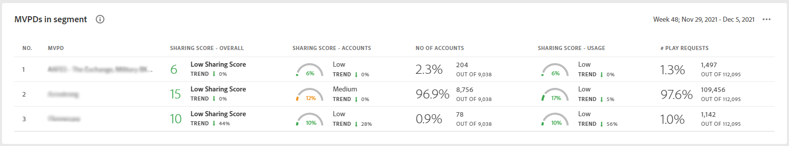

# Het dashboard {#dashboard}

Het dashboard vat gegevens samen en voegt deze samen in een verzameling grafieken en rapporten die zijn ontworpen om een uitgebreid overzicht te geven van de reikwijdte en de impact van het delen van accounts. Het verstrekt één enkele pagina die de belangrijkste rapporten en metriek van Rekening IQ bevatten.

## Geaggregeerde delingsscore {#aggregated-sharing}

In het deelvenster Geaggregeerde delende score vindt u een overzicht van de hoeveelheid en impact van het delen van accounts en het streamingvolume.

De waarden helpen u de grootte van credentiedelen door uw abonnees begrijpen, vandaar die een maatregel van de behoefte verstrekken om op het te handelen.

De volgende drie metriek zijn componenten van de Geaggregeerde delende Score.

### Niveau voor delen {#sharing-level}

De het delen niveaumaat toont het percentage van al uw abonneerekeningen (in het bepaalde segment) die, tijdens het geselecteerde tijdkader worden gedeeld.

Een waarde die wordt berekend op basis van het gemiddelde van de waarschijnlijkheid van delen die is berekend voor elke account in de set geselecteerde MVPD&#39;s die tijdens het geselecteerde tijdframe vanuit een van de geselecteerde programmeerkanalen is gestreamd.

De indicator van de Trend toont de percentageverandering in de waarde van metrisch binnen van het vorige tijdkader.

### Gebruik van gedeelde accounts {#usage-from-shared-accounts}

Dit cijfer wijst op welk percentage van het gebruik van alle abonneerekeningen van de gedeelde rekeningen voor het bepaalde segment en de tijdspanne is. De maatstaf geeft de gebruikscategorieën (van gedeelde accounts) aan op een schaal van 0 tot 100%. Deze waaiers-genoemd Laag, Normaal, Hoog, en Abnormal-zijn gebaseerd op het de industriestandgemiddelde.

U kunt ook de Trend-indicator zien, die een toename of afname in het gebruik van gedeelde accounts in vergelijking met het vorige tijdkader weergeeft.

### Algehele score voor delen {#overall-sharing-score}

De algemene score voor delen bestaat uit het delen van scores, waaronder &quot;Niveau delen&quot; en &quot;Gebruik z van gedeelde accounts&quot;.

Het levert een waarde op die de relatieve impact van delen weergeeft in vergelijking met de bedrijfstak. Het doel is vergelijkbaar met dat van een creditscore, waarbij de situatie wordt samengevat met één cijfer. Maar in dit geval, hoe hoger het aantal hoe groter de potentiële schade.

<!--### MVPDs in segment {#mvpd-in-segment}

It is a table of risk indices and accounts totals for the top MVPDs ranked by overall usage or account sharing.

-->

### Globale score voor delen voor MVPD&#39;s voor de hele industrie {#top-mvpds}

Deze lijst verstrekt een vergelijkende mening van de verschillende Geaggregeerde het Delen Scores voor MVPDs in het segment.

>[!NOTE]
>
>In deze tabel worden algemene bedrijfsgegevens gebruikt voor vergelijkende doeleinden, niet de gegevens die door die MVPD&#39;s in het segment worden vertegenwoordigd.

### Muziek delen via kanalen en MVPD&#39;s {#sharin-score-by-channels-and-mvpds}

Deze tabel biedt een vergelijkende weergave van het delen van scores van de geselecteerde kanalen voor de MVPD&#39;s in het huidige segment.

### Rekeningen met waarschijnlijkheid {#accounts-sharing-probability}

Dit diagram verdeelt de rekeningen in reeksen van het delen kanskwintielen van zeer laag (0-20%) aan zeer hoog (80=100%).

>[!NOTE]
>
>De staafgrafiek gebruikt een logaritmische schaal.

### Aantal rekeningen en gebruik door kansniveau te delen {#number-of-accounts-usage-sharing-probability}

In dit deelvenster vindt u een tabeloverzicht van de accounts die zijn verdeeld in reeksen waarschijnlijkheidskwintielen van zeer laag (0-20%) tot zeer hoog (80=100%) waarbij elke kwintiel gebruik maakt van gedeelde accounts.

