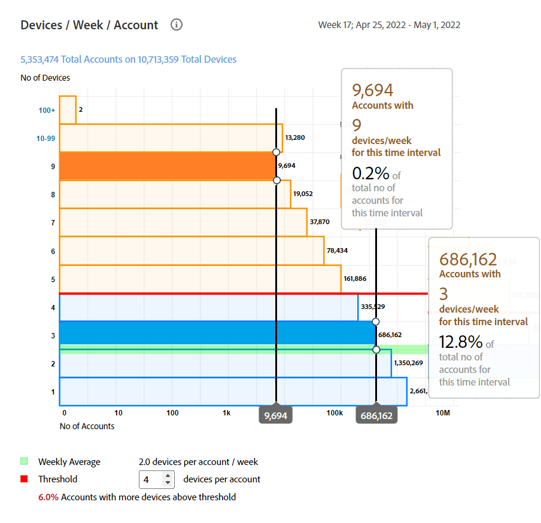

# Algemene gebruiksrapporten {#general-usage-reports}

IQ-rapporten van accounts zijn standaard analytische hulpmiddelen en rapporten waarmee u gegevens kunt doorzoeken om te isoleren [cohorten](/help/AccountIQ/product-concepts.md#segmet-def), anomalieën te identificeren en inzicht in uw accountkenmerken te krijgen.

De pagina met algemene verbruiksrapporten bevat gereedschappen voor het uitsplitsen van metrische gegevens voor subgroepen op basis van het aantal gebruikte accountapparaten, de gedetecteerde IP&#39;s en de respectievelijke ZIP-codes.

<!--Divide the content in cohorts.

Content filters
device filters

segment and definition replicate to cohorts. Number of people and number of account that ......
content consumption.....-->

De rapporten zijn allen gebaseerd op het huidige geselecteerde segment gebruikend [Segmenten en tijdkader](/help/AccountIQ/howto-select-segment-timeframe.md) deelvenster. U kunt uw selectie verfijnen en deze verder verkleinen door drempelwaarden (aantal apparaten, aantal IP&#39;s en aantal postcodes) op te geven in [Overzicht van momentopnamen - Accounts boven drempels](#snapshot-overview) deelvenster.

<!--To view General Usage Reports:

1. Select the desired MVPDs from the **MVPDs in Segment** option.

2. Select the desired programmer channels from the **Channels in Segment** Option.

3. Select an appropriate time frame from the **Granularity and time frame** option.

   Using the above options you have defined segments for your analysis. Based on your segment selection, following graphs and reports are displayed.

4. You can fine tune your selection and further narrow it down by specifying (number of devices, number of IPs, and number of zip codes) thresholds in [Snapshot Overview - Accounts above thresholds](#snapshot-overview) widget/panel.-->

## AuthN OK / AuthZ OK / Play Requests / Unique Subscribers {#authn-authz-playreq-uniquesubs}

De lijngrafieken hier geeft u een mening van de veranderingen in tijd in waarden van O.K. AuthN, O.K. AuthZ, de Verzoeken van het Spel, en de Unieke Abonnees in een geselecteerd tijdkader voor het bepaalde segment.

+++Programmer- **AuthN OK / AuthZ OK / Play Requests / Unique Subscribers**

*Afbeelding: AuthN OK / AuthZ OK / Play Requests / Unique Subscribers for programmeer user*

+++

+++MVPD- **AuthN OK / AuthZ OK / Unieke abonnees**

*Afbeelding: AuthN OK / AuthZ OK / Unique Subscribers for MVPD user*

+++

De x-as stelt de eenheden binnen het huidige tijdkader voor en de y-as vertegenwoordigt de basisgegevens van de abonneeactiviteit tijdens die periode. Met de lijngrafieken kunt u de volgende waarden vergelijken voor de abonnees van MVPD&#39;s en kanalen die u in het deelvenster voor segmentselectie hebt geselecteerd:

* **AuthN OK**

   AuthN OK is het aantal geslaagde authenticaties. Zie voor meer informatie en definitie [Productconcepten: AuthN OK](/help/AccountIQ/product-concepts.md#authn-ok-def).

* **AuthZ OK**

   AuthZ OK is het aantal geslaagde autorisaties. Zie voor meer informatie en definitie [Productconcepten: AuthZ OK](/help/AccountIQ/product-concepts.md#authz-ok-def).

* **Verzoeken afspelen**

   De verzoeken van het spel zijn het aantal Verzoeken van het Spel. Zie voor meer informatie en definitie [Productconcepten: Aanvragen afspelen](/help/AccountIQ/product-concepts.md#play-requests-def)

   >[!NOTE]
   >
   >De grafiek van de spelverzoeken lijngrafiek is niet beschikbaar voor gebruikers MVPD.

* **Unieke abonnees**

   De unieke abonnees zijn het aantal succesvolle unieke abonnees. Zie voor meer informatie en definitie [Productconcepten: Unieke abonnees](/help/AccountIQ/product-concepts.md#unique-subscriber-def)

   >[!NOTE]
   >
   >Het totale aantal unieke abonnees omvat ook het aantal unieke apparaten als het gebruik van Adobe TempPass door een programmeur (dat vrije voorproef is) deel van het segment uitmaakt.

## Overzicht van momentopnamen - Accounts boven drempels {#snapshot-overview}

Stel uw analyses en rapporten nauwkeurig af met dit extra filter om verschillende gebruiksdrempels in te stellen. Nadat u het segment (of de cohort) voor analyse hebt gedefinieerd door de gewenste MVPD(s) en kanalen te selecteren, kunt u ook de volgende filters gebruiken om het gedrag van abonnees te analyseren:

* Drempel aantal apparaten

* Aantal IPs Drempel

* Drempel voor aantal postcodes

Als u drempelwaarden bijwerkt in [Accounts-segment - gebaseerd op geselecteerde drempels](#account-segments-basedon-segments) kunt u het effect bekijken in:

* [Apparaten per week (of maand) per account](#devices-week-account)

* [Locaties per week (of maand) per account](#locations-week-account)

* [IPs per week (of maand) per rekening](#ip-week-account)

* [Historische weergave van het segment rekeningen](#account-segment-historical-view)

>[!NOTE]
>
>De standaardwaarde voor elk van de drempels is 4. Wat betekent, toont de Algemene pagina van het Gebruik analyse voor MVPDs met abonnees die vier (en meer dan vier) apparaten gebruiken, verbruikend inhoud van vier (en meer) verschillende geografische plaatsen en vier (en meer) verschillende postcodes.

### Accounts-segment - gebaseerd op geselecteerde drempels {#account-segments-basedon-segments}

De **Accounts-segment - gebaseerd op geselecteerde drempels** biedt u opties om drempelwaarden (tussen 1 en 10) in te stellen voor het aantal apparaten, het aantal IP&#39;s en het aantal ZIP-codes.

In de grafiek ziet u het volgende:

* het absolute aantal abonneerekeningen, en

* percentage van de totale abonnementrekeningen in dat segment;

   die het aantal van X apparaten, het aantal van Y van IPs, en het aantal van Z codes van het ZIP gebruiken om inhoud van uw kanaal voor (bepaald segment van) MVPDs, voor een tijdkader te verbruiken.

## Apparaten per week (of maand) per account {#devices-week-account}

De **staafgrafiek** biedt inzichten in het gebruiksgedrag in termen van hoe de abonnees hun apparaten gebruiken om toegang te krijgen tot inhoud.

Het aantal accounts van de x-asplots en het aantal apparaten van de y-as. Gebaseerd op de drempel u voor aantal apparaten per rekening plaatst, merkt het het absolute aantal abonneerekeningen die inhoud van specifiek aantal apparaten in de duur van een week verbruiken.

Wanneer het bedekken over een bar (specifiek voor aantal apparaten), verschijnt een etiket dat informatie over het aantal abonneerekeningen (en het percentage van totale abonneerekeningen in segment) geeft die kanaalinhoud stromen gebruikend die vele apparaten in een week.

De grafiek geeft ook het volgende aan:

* Een rode lijn om de ingestelde drempel te markeren.

* Een groene lijn om het gemiddelde van het aantal verschillende apparaten te merken die door een abonneerekening per week (of maand) worden gebruikt.

U kunt het drempelniveau vergelijken met het wekelijkse gemiddelde van het aantal verschillende apparaten dat door een account wordt gebruikt, om het niveau van delen te bepalen.

De grafiek geeft ook een glimp van het percentage abonneerekeningen die meer apparaten dan de vastgestelde drempel gebruiken.

Met het donutdiagram kunt u in één oogopslag de grootte beoordelen van abonneeaccounts die kanaalinhoud verbruiken met apparaten die de ingestelde drempelwaarde (in een tijdframe) overschrijden.

## Locaties per week (of maand) per account {#locations-week-account}

leuk [Apparaten per week (of maand) per account](#devices-week-account)Met de maatstaf voor locaties per week (of maand) per account kunt u het gebruik van de abonneeaccount op verschillende locaties analyseren om het delen van wachtwoorden beter te identificeren. Het x-as palet Aantal Rekeningen, en de y-asPunten Aantal Plaatsen.

Resultaten van deze metrische methode gecombineerd met het aantal [Apparaten per week (of maand) per account](#devices-week-account) en aantal [IPs per week (of maand) per Rekening](#ip-week-account) helpen u nauwkeuriger de instanties van het delen van wachtwoord beoordelen; zodat authentieke gebruikers niet worden meegerekend.

Als u een segment hebt gedefinieerd en de drempel voor het aantal locaties hebt ingesteld, kunt u dit in de grafiek identificeren:

* Aantal (en percentage) abonnees die inhoud van (a specifiek) x aantal plaatsen in een week verbruiken.

* Percentage van totale abonneerekeningen die inhoud van meer plaatsen dan de drempel bekijken.

* Vergelijk het wekelijkse gemiddelde (aantal verschillende locaties voor een account) met Drempel.

## IPs per week (of maand) per Rekening {#ip-week-account}

Vergelijkbaar met [Apparaten per week (of maand) per account](#devices-week-account) en [Locaties per week (of maand) per account](#locations-week-account)de **Aantal IP&#39;s per week per account** Met metrisch kunt u het delen van wachtwoorden nauwkeuriger en korter analyseren.

Het x-as plots Aantal Rekeningen, en het y-asPunten Aantal IPs.

Zodra u een segment hebt bepaald (door MVPDs en kanalen te selecteren) en de drempel voor aantal IPs te plaatsen, kunt u van de grafiek identificeren:

* Aantal (en percentage) abonnees die inhoud van (a specifiek) x aantal IP in een week verbruiken.

* Percentage van totale abonneerekeningen die inhoud van meer IP adressen dan de drempel bekijken.

* Vergelijk het wekelijkse gemiddelde (aantal verschillende IPs voor een rekening) met Drempel.

## Accounts-segment - Historische weergave {#account-segment-historical-view}

De grafiek van de bar van de Historische Mening helpt u de gebruiksmetriek over verschillende tijdkaders vergelijken. Bovendien worden de verschillende gebruiksmetriek, zoals [Apparaten per week (of maand) per account](#devices-week-account), [Locaties per week (of maand) per account](#locations-week-account), en [IPs per week (of maand) per Rekening](#ip-week-account).

* De x-as zet het tijdkader in kaart, en de y-as geeft het aantal abonneerekeningen, apparaten, plaatsen en IP&#39;s toe.

* De oranje gekleurde balken geven segmenten in verschillende tijdframes aan.

* In de lijngrafiek worden de wijzigingen in [Apparaten per week (of maand) per account](#devices-week-account), [Locaties per week (of maand) per account](#locations-week-account), en [IPs per week (of maand) per Rekening](#ip-week-account) waarden over het tijdkader die op de drempel worden gebaseerd.

* De blauwe balken geven het totale aantal actieve abonnees in de hele branche aan voor een tijdsperiode.

* U kunt specifieke legenda selecteren en deze helpen u de grafiek te schalen.

>[!MORELIKETHIS]
>
>* Weet hoe te om rapporten voor hoogste 1000 abonnees in het geselecteerde segment uit te voeren gebruikend filters in het Algemene Rapport van het Gebruik gebruikend [Bovenste 1000-accounts exporteren](/help/AccountIQ/export-acc-information.md) optie.

