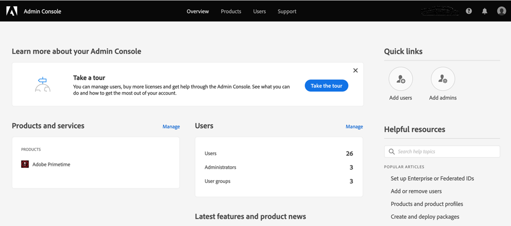

# Hoe u aan boord kunt gaan en aan de slag kunt met Account IQ {#onboard}

Account IQ is een gehoste webtoepassing. Als u deze analysetool wilt gaan gebruiken als een D2C-streamingprovider, -programmeur of -distributeur (MVPD) en het delen van referenties wilt beperken, moet u uw organisatie in Adobe Experience Cloud-organisaties inschakelen en gebruikers van de organisatie toewijzen aan **IQ van primetime-account** profiel op [Adobe Admin Console](https://adminconsole.adobe.com/). Lees verder om de voorwaarden en details aan boord te kennen.

## Voorwaarden voor browsers {#browser-prerequisites}

Account IQ is compatibel met de meest recente versies van de volgende browsers:

* Google Chrome
* Safari
* Mozilla Firefox

## Stappen aan boord {#steps-to-onboard}

1. Uw organisatie laten registreren **Adobe Experience Cloud** contact met organisaties **Adobe** door een e-mail te verzenden naar tve-support@adobe.com.

1. Organisatiegebruikers toewijzen aan **TVE-dashboard lezen-schrijven** of **TVE-dashboard, alleen-lezen** profielen in [Adobe Admin Console](https://adminconsole.adobe.com/).

   De Admin-gebruikers in uw organisatie kunnen gebruikers maken en hen toegang verlenen tot het IQ-dashboard en de Rapporten van de account. Om gebruikers van organisaties toegang tot IQ van de Rekening te verlenen, moeten de beheerders van de organisatie:

   1. Aanmelden bij [Adobe Admin Console](https://adminconsole.adobe.com/).

      

   1. Selecteren **Adobe Primetime** van **Producten en diensten**.

   1. Van **Productprofielen** Selecteer een van de **TVE-dashboard lezen-schrijven** of **TVE-dashboard, alleen-lezen** profiel.

      

      >[!NOTE]
      >
      >In de nabije toekomst wordt IQ van Primetime-account gesplitst van TVE-dashboard.

   1. Van hier kunt u gebruikersgroepen tot stand brengen, of bestaande groepen selecteren om gebruikers aan toe te voegen.

      

   1. Selecteren **Gebruiker toevoegen** om gebruikers toe te voegen.

>[!IMPORTANT]
>
>Als uw gebruikers het IQ-dashboard van uw account niet kunnen openen, neemt u contact op met de Adobe-ondersteuning om ervoor te zorgen dat de ID van uw organisatie wordt vermeld in Account IQ.

