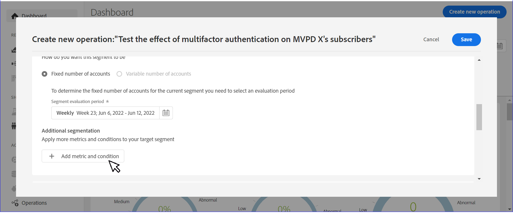

# Een bewerking maken op een gebruikerssegment {#operation-to-track-segment}

Elke rapportpagina op de IQ van de Rekening heeft a **Nieuwe bewerking maken** optie om u te helpen werkschema&#39;s tot stand brengen om diverse (bulk) acties op abonneerekeningen te automatiseren (en te vereenvoudigen); Definieer regels om een voorbeeld op te geven, acties te definiëren en de effecten van die acties op te nemen en te analyseren. Op de pagina voor het maken van bewerkingen kunt u het voorbeeld definiëren van gebruikersgroepen waarop bewerkingen worden uitgevoerd en de bewerking plannen die op een toekomstige datum moet worden uitgevoerd.

Een bewerking maken:

1. Definieer het segment (cohort) voor analyse op een van de pagina&#39;s met rapporten of dashboards met behulp van de stappen in [Segmenten en tijdkader definiëren](/help/AccountIQ/howto-select-segment-timeframe.md).

1. Selecteren **Nieuwe bewerking maken** Deze optie is beschikbaar op alle pagina&#39;s met rapporten of dashboards. De **Nieuwe bewerking maken** wordt weergegeven.

   
   *Afbeelding: Pagina om nieuwe bewerking te maken*

1. Op de **Nieuwe bewerking maken** pagina, vult de gegevens in de formuliervelden in voor:

   * [Handelingsnaam](#operation-details) in Bewerkingsdetails
   * Segment waarop de bewerking moet worden uitgevoerd [Doelsegment](#segment) en het segment verfijnen met [Aanvullende segmentering](#additional-segmentation)
   * [Segmenttype](#segment-type) krachtens [Doelsegment](#segment)
   * [Handeling](#action)
   * [Activering van schema](#schedule)

1. [De bewerking opslaan](#save-operation).

## Bedrijfsgegevens {#operation-details}

+++Programma-verrichtingsdetails

Geef de nieuwe bewerking een naam in **Handelingsnaam** onder Bewerkingsdetails. Bijvoorbeeld &quot;*Test het effect van multifactorauthentificatie op abonnees van MVPD X&quot;of &quot;Beperk het aantal stromen in Gelijktijdige Controle&quot;of &quot;Beperk MVPD&#39;s abonnees die kanaal &quot;N&quot;van 20 plus apparaten bekijken*&quot;.

+++

+++MVPD- verrichtingsdetails

Geef de nieuwe bewerking een naam in **Handelingsnaam** onder Bewerkingsdetails. Bijvoorbeeld &quot;*Test het effect van multifactorauthentificatie op de kijkers van kanaal N&quot;of &quot;Beperk het aantal stromen in Gelijktijdige Controle&quot;of &quot;Beperk de abonnees die kanaal &quot;N&quot;bekijken van 20 plus apparaten*&quot;.

+++

## Doelsegment {#segment}

+++Programmer- doelsegment

De **Segment** Hier worden de gebruikers vermeld die door deze verrichting zullen worden geëxploiteerd; of de voorbeeldgroep voor uw bewerking. Het standaardsegment is **segment** u hebt geselecteerd met [segment en tijdframe, deelvenster](/help/AccountIQ/howto-select-segment-timeframe.md) op de pagina met hoofdrapporten of dashboards in stap 1 hierboven.

<!--* The first segment entry in the **Segment** section, by default, shows the **segment** you selected in the step 1.

* The **segment evaluation period** is the time period of analysis you selected in step 1 from **Granularity and Timeframe** option.

*Figure: Segment and timeframe selection on the main page*-->

Dit segment bepaalt de abonnees die door de verrichting zullen worden beïnvloed die wordt gecreeerd. Het geselecteerde segment kan bijvoorbeeld *alle abonneerekeningen van MVPD genoemd &quot;C&quot;die het kanaal &quot;N Sport&quot;bekijken*.

+++

+++MVPD- Doelsegment

De **Segment** Hier worden de gebruikers vermeld die door deze verrichting zullen worden geëxploiteerd; of de voorbeeldgroep voor uw bewerking. Het standaardsegment is **segment** u hebt geselecteerd met [segment en tijdframe, deelvenster](/help/AccountIQ/howto-select-segment-timeframe.md) op de pagina met hoofdrapporten of dashboards in stap 1 hierboven.

<!--* The first segment entry in the **Segment** section, by default, shows the **segment** you selected in the step 1.

* The **segment evaluation period** is the time period of analysis you selected in step 1 from **Granularity and Timeframe** option.

*Figure: Segment and timeframe selection on the main page*-->

Dit segment bepaalt uw abonnees (die kijkers van specifieke kanalen zijn) die door de verrichting zullen worden beïnvloed die wordt gecreeerd. Uw (standaard)segment bevat bijvoorbeeld *alle abonneeaccounts die het kanaal &#39;N Sports&#39; weergeven*.
+++

### Aanvullende segmentering {#additional-segmentation}

Bovendien, kunt u uw doelsegment verfijnen door meer metriek toe te voegen. U kunt bijvoorbeeld een deelkenmerk van meer dan 90% toevoegen als een andere metrische waarde. Dus nu leest de probleemverklaring *&quot;creeer een verrichting voor abonneerekeningen van MVPD genoemd &quot;C&quot;die het kanaal &quot;N Sports&quot;bekijken die een het delen waarschijnlijkheid groter 90% hebben&quot;*.

*Afbeelding: Aanvullende segmentering*

Verder, als u de verrichting door nog metrisch voor aantal apparaten toe te voegen verfijnen, dan leest de bijgewerkte probleemverklaring *&quot;creeer een verrichting voor abonneerekeningen van MVPD genoemd &quot;C&quot;die het kanaal &quot;N Sports&quot;bekijken die een het delen score boven 90 hebben en meer dan 5 apparaten gebruiken om inhoud tijdens de evaluatieperiode te bekijken&quot;*.

*Afbeelding: Verfijnd voorbeeldsegment met algemene score voor delen en aantal maateenheden van apparaten*

Hierdoor wordt de gebruikersgroep verfijnd. Dus door meer metriek en voorwaarden toe te voegen, kwalificeert u verder het segment om de rekeningen te bepalen waarop te werken.

### Segmenttype {#segment-type}

Segmenttype is de manier waarop een segment gedurende de gehele evaluatieperiode van de operatie wordt behandeld.

*Afbeelding: Verfijn het aantal segmenten om te werken op het gebruiken van het type van Segment*

<!--The segment type option allows you to further refine your segment based on the evaluation period (or time).

**Fixed number of accounts** 

When you select **Fixed number of accounts** segment type, then you need to specify an evaluation period as well.

By doing so, you are fixing the sample size for evaluation in terms of numbers. You are making Account IQ identify a specific set of users (that meet the criteria of defined evaluation period and segment metrics) to operate on. The analysis and graphs will be generated for this specific set of users only (identified initially) throughout the operation.

**Variable number of accounts**

When you select **Variable number of accounts** segment type, you do not limit the number of accounts in segment. The accounts which fall under the defined segment metrics are the part of the segment, and the number of accounts will change continuously during the course of operation.-->

>[!IMPORTANT]
>
>U kunt alleen **Vast aantal accounts** nu. De optie om te selecteren **Variabel aantal rekeningen** zijn beschikbaar in komende releases.

<!--

you tell Account IQ in the beginning of the operation which number of accounts to operate on.

Account IQ system only has a segment definition, and during the operation it looks into all the accounts that fit that segments.

the number of accounts in segment is not limited, the accounts that fall under defined segment metrics will be part of the segment, and the no of accounts will change continuously, as there are no specific limitations - like an evaluation period in the past.When the segment is defined (which in this example is, subscriber accounts of MVPD 'C' who are viewing the channel 'N Sports' that have a sharing score above 80 and are using 10 different IPs) and we also identified a time period to evaluate a segment. This identifies X number of accounts as sample (for example 5000). How many devices they are using?
It identifies x-number of accounts (5000)...a very specific set of users that meet this criteria.
for every period that we schedule (within that operation) during that operation) we will look at those 5K users that are originally identified and we will present graph about them. How are the sharing scores coming up?u We identified a period. Are their sharing scores going up? Are there fewer of them who are meeting this definition?
Fixed versus variable is the way the treated in fixed or variable way.

1. we identified a fixed set of accounts.
2. we evaluate those specific accounts on criteria throughout the operation.

General idea independent of graph is that we will evaluate a set of accounts identified initially, for no of periods during operation and generate graphs against that.
Those are the 5000 users for which I will create graphs for for every period of the operation.

**Variable number of accounts**
We do not identify any initial set of accounts, we just have a segment definition.
Each period during the operation, we go and look into all the accounts that fit that segments.
If it is not a fixed segment, I won't initially evaluate it. I won't have an initial set of 5000. Instead at every period during the evaluation I will evaluate the segment then, and then I will produce graph about the next 3000 users.
the......will vary from period to period.

if not fixed segment, then I won't initially evaluate or have initial set of 5000, instead at every period during an operation and the.-->

## Handeling {#action}

De **Handeling** bepaalt welke verrichting u op het bepaalde segment zult uitvoeren.

U kunt twee soorten acties uitvoeren:

* acties met systemen die zijn geïntegreerd met Account IQ; zoals [Gelijktijdige bewaking](https://tve.helpdocsonline.com/concurrency-monitoring-introduction)<!--, or Adobe Target-->.

* Handelingen voor het maken en verwerken van workflows die extern zijn voor Account IQ en niet zijn geïntegreerd met Account IQ-systeem. Bijvoorbeeld, een actie voor kanaalprogrammeur &quot;N&quot;om bulkmail naar alle abonnees van MVPD &quot;C&quot;te verzenden.

>[!NOTE]
>
>Door verrichtingen tot stand te brengen, specificeert u niet alleen acties en bepaalt hun werkingsgebied, maar ook begint het effect van deze verrichtingen te registreren.

## Schema{#schedule}

U kunt de activering voor de bewerking plannen door begin- en einddatums in te stellen.

>[!NOTE]
>
>De begindatum en de einddatum hebben een granulariteit het zelfde als granulariteit u voor de evaluatie selecteerde toen het bepalen van segment gebruikend **segment en tijdframe, deelvenster**, in stap 1.
>
>
>Dus als u de granulariteit selecteert als Week, dan zijn de begin- en einddatums in termen van week (bijvoorbeeld Week 14); als u granulariteit kiest als Maand, dan zijn de begin en einddata in termen van maanden.

>[!IMPORTANT]
>
>De begindatum moet later zijn dan de evaluatieperiode en ook later dan de huidige datum. De einddatum moet ook later zijn dan de begindatum en de huidige datum.

### De bewerking opslaan {#save-operation}

Wanneer u de bewerking opslaat, wordt er een berichtvenster weergegeven dat aangeeft dat het segment dat u in deze bewerking hebt gedefinieerd, ook voor de toekomst wordt opgeslagen. Nochtans, moet u dit segment noemen.

*Afbeelding: Bewerking opslaan en segmentnaam opgeven*

>[!NOTE]
>
>Het is aan te raden de bewerking een naam te geven op basis van de handeling die u uitvoert in combinatie met het segment waarop u wilt reageren.

<!--In future you can select this saved segment when defining a segment for your analysis on the main reports page. Moreover, the saved segment is also listed when you create an operation the next time.

*Figure: Saved segments in segment selector on Create new operations page* 

>[!IMPORTANT]
>
>When creating an operation, if you select a segment that was previously created then you cannot add new metrics to it and refine it.
>
>Adding new metrics creates a new segment, but you cannot modify an existing segment.-->

Nadat u een bewerking hebt gemaakt, loopt deze van de begindatum tot de einddatum die u hebt opgegeven.

De details van de opgeslagen bewerking zijn te vinden op de hoofdmap [Bewerkingen](/help/AccountIQ/operations.md) pagina.

*Afbeelding: Nieuw gemaakte bewerking wordt vermeld op de hoofdpagina Bewerkingen*
