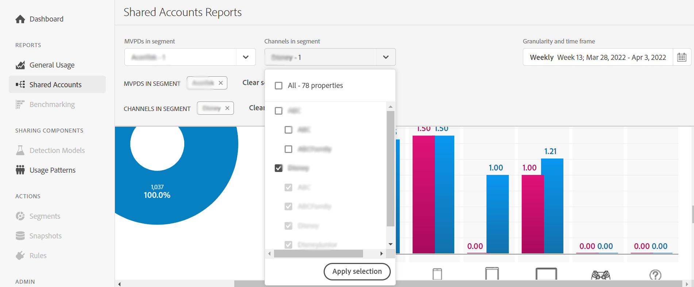

# Rapporten over het delen van accounts weergeven: voor een specifieke MVPD <!--and programmer--> {#report-sp-mvpd}

Als u als een kanaal bent aangemeld bij de IQ-toepassing van de account [programmeur](/help/AccountIQ/product-concepts.md#programmer-def), kunt u rapporten over het delen van uw kanaalviewers weergeven voor de specifieke [MVPD](/help/AccountIQ/product-concepts.md#mvpd-def) ze hebben zich geabonneerd op.

Als u rapporten wilt weergeven in Account IQ, nadat u zich met succes hebt aangemeld bij de toepassing als programmeur:

1. Definieer uw abonesegment voor analyse en het bekijken rapporten gebruikend stappen in [Hoe te om segment te bepalen](/help/AccountIQ/howto-select-segment-timeframe.md).

   >[!NOTE]
   >
   >U kunt één, twee, of veelvoudige MVPDs selecteren, of zelfs standaardselectie van top 10 MVPDs (door score, gebruik, of rekeningen te delen).
   >
   >
   >U kunt echter [maximaal 10 MVPD&#39;s](/help/AccountIQ/limitations.md) van de MVPD-kiezer in de [segment en tijdframe, deelvenster](/help/AccountIQ/segments-timeframe.md).

1. Selecteer een gewenste pagina met rapporten in de linkernavigatie:

* [Algemeen gebruik](/help/AccountIQ/general-usage-reports.md)

   
* [Gedeelde accounts](/help/AccountIQ/shared-acc-reports.md)

   
* [Gebruikspatronen](/help/AccountIQ/usage-patterns.md)

   

* [Dashboard](/help/AccountIQ/dashboard.md) (Het dashboard geeft een glimp van de geselecteerde grafieken van verschillende rapportpagina&#39;s).

   

Elk van deze pagina&#39;s geeft de activiteit weer.

<!--## If you are logged in as an MVPD {#report-sp-programmer}

To view reports in Account IQ, once you have successfully logged in to the application as an MVPD:

1. Select the desired programmer channel(s) from from the **Channels in segment** drop-down option.

   

 1. From the **Granularity and time frame** option, select the time interval to view reports. You can aggregate the time intervals week-wise or month-wise.

1. Select a desired reports page from the left navigation-[General Usage](/help/AccountIQ/general-usage-reports.md), [Shared Accounts](/help/AccountIQ/shared-acc-reports.md), [Usage Patterns](/help/AccountIQ/usage-patterns.md), or even [Dashboard](/help/AccountIQ/dashboard.md) (dashboard gives a glimpse of the selected graphs from different reports pages).

-->