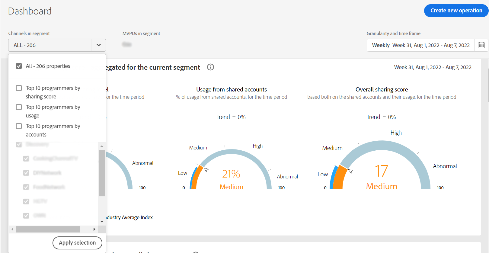

# De segmenten van de abonnee en tijdkader {#cohorts-segments}

Als u zich aanmeldt bij Account IQ, bevindt zich bovenaan een venster waarin u de abonnee kunt definiëren [segment](/help/AccountIQ/product-concepts.md#segment-segmet-def) om uw resultaten voor het bekijken van rapporten voor abonnee te filtreren delend gedrag en patronen.

<!---->

+++Deelvenster Segment selecteren voor programmeur

<!---->

De volgende vervolgkeuzemogelijkheden worden gebruikt om segmenten te definiëren:

**MVPD&#39;s in segment**

De **MVPD&#39;s in segment** kunt u de [MVPD&#39;s](/help/AccountIQ/product-concepts.md#mvpd-def) (personen of groepen) voor wie u de rapporten voor het delen van accounts wilt bekijken.

In deze kiezer kunt u, naast het selecteren van de afzonderlijke MVPD&#39;s, ook de volgende groepen selecteren:
* [De hoogste 10 MVPDs door score te delen](/help/AccountIQ/product-concepts.md#top-mvpds-def)

* [De hoogste 10 MVPDs door gebruik](/help/AccountIQ/product-concepts.md#top-mvpds-def)

* [Top 10 MVPD&#39;s per account](/help/AccountIQ/product-concepts.md#top-mvpds-def)

* [Isolatiemodus](/help/AccountIQ/isolation-mode.md)

**Kanalen in segment**

Wanneer u bent aangemeld als programmeergebruiker, kunt u uw kanalen selecteren om de analyse voor het delen van accounts weer te geven. Gebruik de **Kanalen in segment** met vervolgkeuzelijst om afzonderlijke of meerdere kanalen in uw organisatie te selecteren.

+++

+++Deelvenster Segment selecteren voor MVPD&#39;s

**Kanalen in segment**

De **Kanalen in segment** kunt u het filter verder verkleinen om kanalen te selecteren die overeenkomen met de geselecteerde MVPD&#39;s.

* [De 10 belangrijkste programmeurs door score te delen](/help/AccountIQ/product-concepts.md#top-mvpds-def)

* [De tien meest gebruikte programmeurs](/help/AccountIQ/product-concepts.md#top-mvpds-def)

* [Top 10 van programmeurs via accounts](/help/AccountIQ/product-concepts.md#top-mvpds-def)

**MVPD(s) in segment**

Wanneer u als gebruiker MVPD het programma wordt geopend, dan wordt uw naam getoond op het gebied voor **MVPD&#39;s in segment**.

+++

<!--For example, you can define your segment as the "subscribers of the MVPD A that watched the channels X, Y, and Z".-->

* **Korreligheid en tijdkader**

   De **Korreligheid en tijdkader** kunt u de datums en de duur of de tijdgrootte opgeven waarvoor u het deelgedrag van de abonnee wilt weergeven.

Zo, met deze controles kunt u uw probleemverklaring als &quot;abonnees van MVPD A bepalen die de kanalen X, Y, en Z in de maand van Mei keek&quot;.

