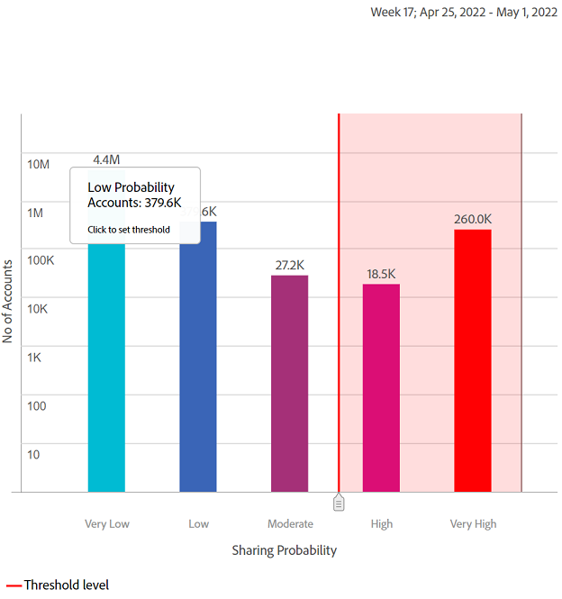

# Rapporten over gedeelde accounts {#shared-accounts-reports}

In de rapporten Gedeelde accounts worden de maatstaven, zoals het aantal apparaten en apparaattypen, uitgesplitst op basis van het geselecteerde bereik voor het delen van de waarschijnlijkheid, bijvoorbeeld **Te matige betrouwbaarheid** en **Te lage waarschijnlijkheid** voor het huidige segment.

Deze bereiken kunnen dan dienen als door de gebruiker gedefinieerde drempels en de grafieken worden bijgewerkt op basis van de geselecteerde drempels.

Rekening-IQ classificeert alle abonneerekeningen van het gedefinieerde segment in de rekeningen met de volgende vijf categorieën op basis van hun waarschijnlijkheid van delen:

* Zeer hoog (80%-100%)
* Hoog (60%-80%)
* Matig (40%-60%)
* Laag (20%-40%)
* Zeer laag (0%-20%)

## Waarschijnlijkheid voor het delen van accounts {#accounts-sharing-probability}

Het donut diagram hier categoriseert en toont de percentages (en absolute aantallen) van de abonneerekeningen van diverse kanscategorieën.

De rode lijn geeft het drempelbereik aan dat door gebruikers in [Rekeningen boven drempel in huidig segment](#threshold-selector) deelvenster.

In het staafdiagram wordt het aantal accounts op de y-as weergegeven voor verschillende categorieën van waarschijnlijkheid van delen (weergegeven op x-as).

De rode lijn geeft het drempelbereik aan en kan worden aangepast in het staafdiagram. De drempel die in het staafdiagram wordt aangepast, weerspiegelt in het drempelbereik in het donutdiagram.

<!---->

### Rekeningen boven drempel in huidig segment{#threshold-selector}

In dit deelvenster kunt u een bereik selecteren van de volgende waarden als drempel voor abonneeaccounts (op basis van hun tekenwaarschijnlijkheid):

* Accounts **te laag** delen **waarschijnlijkheid**

* Accounts **overlaag** delen **waarschijnlijkheid**

* Accounts **overmatig** delen **waarschijnlijkheid**

* Accounts **te hoog** delen **waarschijnlijkheid**

Zodra u de drempel selecteert, toont het paneel het percentage (en het aantal) rekeningen van alle abonneerekeningen in het geselecteerde segment.

## Segment - Verzoeken afspelen van totaal {#play-request-out-total}

In het donutdiagram worden het percentage (en het aantal) afspeelverzoeken van abonnees in het segment weergegeven. en laat u de spelverzoeken vergelijken die door abonnees niet in het bepaalde segment worden gemaakt.

Wanneer u curseur op de donutgrafiek beweegt, toont het ook abonneepercentages en aantallen van diverse kanswaaiers.

<!---->

## Segment-gemiddeld aantal apparaten per account{#avg-devices-account}

Het staafdiagram toont het gemiddelde aantal apparaten van elk apparatentype in gebruik door abonnees in het huidige segment en abonnees niet in huidige segment.

## Segment - Postcodes per periode per account {#zip-codes-period-account}

In deze grafiek wordt u geïnformeerd over het aantal abonnees dat inhoud van verschillende locaties in een tijdsperiode gebruikt.

U kunt inzoomen om de specificaties van een balk in de grafiek die een reeks locaties in kaart brengt, te versmallen en weer te geven.

<!---->

## Segment - Geografisch bereik / Periode / Rekening {#geo-span-period-account}

Deze staafgrafiek geeft het aantal abonneerekeningen met betrekking tot verschillende geografische waaiers in mijlen weer. De waaier is gebaseerd op de maximumafstand tussen de plaatsen waarvan een abonnee tijdens het tijdkader heeft gestroomd.

<!--Total number of users ...

How many accounts are within 99 miles of each other.....and how many are apart. 

Based on points on the map.-->

Wanneer u een balk selecteert die een bereik van geografische afstand vertegenwoordigt, wordt het bereik uitgebreid om meer details weer te geven.

<!---->
