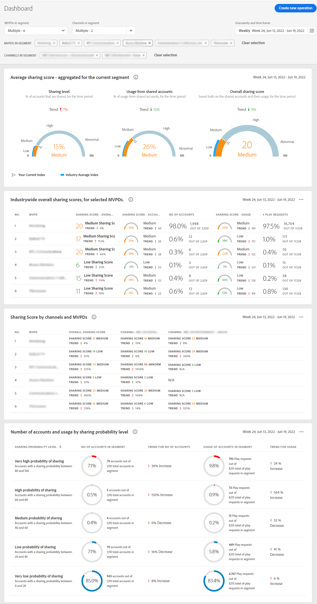

# De verslagen van het rekeningendelen van de mening voor veelvoudige MVPDs {#viewreport-multiple-mvpd}

Rekening IQ die een robuust en scalable analysehulpmiddel is laat u toe om, abonneerekeningen te bekijken te analyseren en te vergelijken die statistieken delen niet alleen voor één, twee, of drie maar voor meer MVPDs op een bepaald ogenblik.

>[!NOTE]
>
>Nochtans, vanaf nu kunt u hoogstens 10 individuele MVPDs van het segment en tijdkaderpaneel selecteren om abonnee te bekijken die statistieken deelt.

Om de rekening te bekijken die van de abonnee statistieken voor veelvoudige MVPDs delen:

1. Een gewenst segment definiëren na de stappen in [Segment definiëren en tijdframe selecteren](/help/AccountIQ/howto-select-segment-timeframe.md) ter evaluatie van [segment en tijdframe, deelvenster](/help/AccountIQ/segments-timeframe.md).

1. Selecteer een gewenste pagina met rapporten in de linkernavigatie:

* [Dashboard](/help/AccountIQ/dashboard.md) (Het dashboard geeft een glimp van de geselecteerde grafieken van verschillende rapportpagina&#39;s).

  

  *Figuur: Het rapport van het dashboard voor veelvoudige MVPDs*

* [Algemeen gebruik](/help/AccountIQ/general-usage-reports.md)

* [Gedeelde accounts](/help/AccountIQ/shared-acc-reports.md)

* [Gebruikspatronen](/help/AccountIQ/usage-patterns.md)

Elk van deze pagina&#39;s geeft de activiteit weer.
