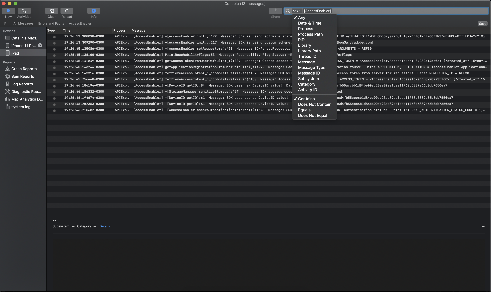

# Fouten opsporen in de AccessEnabler iOS/tvOS SDK met behulp van console-app-logboeken {#debugging-the-accessenabler-iostvos-sdk-using-console-app-logs}

>[!NOTE]
>
>De inhoud op deze pagina wordt alleen ter informatie verstrekt. Voor het gebruik van deze API is een huidige licentie van Adobe vereist. Ongeautoriseerd gebruik is niet toegestaan.

## Overzicht

Het bereik van dit document is om de evolutie van het iOS/tvOS SDK-logboekmechanisme van AccessEnabler vast te leggen en weer te geven, naast enkele nuttige details voor foutopsporing van het AccessEnabler-framework met behulp van de Console-app-logboeken.

## Status van het logboekmechanisme

Het doel van het registratiemechanisme van AccessEnabler iOS/tvOS is het uitzenden van nuttige berichten voor het oplossen van mogelijke problemen die een toepassing die het kader AccessEnabler gebruikt zou kunnen ontmoeten toe te schrijven aan het.

### AccessEnabler iOS/tvOS 3.5.0 en hoger

Vanaf de AccessEnabler iOS/tvOS 3.5.0-versie introduceert het registratiemechanisme de volgende verbeteringen als wijzigingen:

* Het AccessEnabler-framework gebruikt Apple aanbevolen [OSLog](https://developer.apple.com/documentation/os/oslog) uitvoering.

* AccessEnabler-framework introduceert de mogelijkheid om toepassingslogboeken van de console-toepassing te filteren op basis van subsysteem: **com.adobe.pass.AccessEnabler**. Alle berichten die door de SDK worden uitgegeven, maken deel uit van com.adobe.pass.AccessEnabler.

* Het AccessEnabler-framework introduceert de mogelijkheid om de toepassingslogbestanden van de Console te filteren op basis van Willekeurig (voorvoegsel): **[AccessEnabler]**. Alle berichten die door de SDK worden uitgezonden, worden voorafgegaan door [AccessEnabler].

* Het AccessEnabler-framework introduceert de mogelijkheid om toepassingslogboeken van de console-toepassing te filteren op basis van categorie: **foutopsporing**, **fout** in combinatie met een van de twee bovengenoemde criteria: Subsysteem of Willekeurig (voorvoegsel).

## Foutopsporing met console-app-logboeken

Afhankelijk van de kwesties die worden onderzocht kunt u de het registreren berichten willen omvatten of uitsluiten die door het kader AccessEnabler worden uitgegeven, daarom kunt u onder sommige nuttige details vinden die u tijdens onderzoeken en wanneer het gebruiken van de toepassingslogboeken van de Console kunnen helpen.

### AccessEnabler iOS/tvOS 3.5.0 en hoger

#### Inclusief {#including}

Om te beginnen om het even welke registrerenberichten te kunnen zien die door het kader AccessEnabler worden uitgegeven u **moet** Selecteer &quot;Inclusief berichten over info&quot; en &quot;Inclusief foutopsporingsberichten&quot; in het gedeelte Actie van de Console-app, zoals weergegeven in de onderstaande afbeelding.

Om de functionaliteit van AccessEnabler iOS/tvOS SDK en **zie** het AccessEnabler-framework logt u:

* Zoeken in de consoletoepassing met **Subsysteem** Deze optie is gelijk aan de waarde com.adobe.pass.AccessEnabler in de onderstaande afbeelding.

* Zoeken in de consoletoepassing met **Alle** Deze optie bevat de optie
   [AccessEnabler] de waarde in de onderstaande afbeelding.

Naast de twee bovenstaande criteria kunt u ook de opdracht **Categorie** in combinatie met **Subsysteem** of **Willekeurig (voorvoegsel)** om uitdrukkelijk te zoeken naar **foutopsporing** of **fout** niveauberichten die door AccessEnabler iOS/tvOS SDK worden uitgegeven.

#### Exclusief

Om de functionaliteit van andere componenten beter te kunnen zuiveren en **uitsluiten** het AccessEnabler-framework logt u:

* Zoeken in de consoletoepassing met **Subsysteem** optie die niet gelijk is aan de waarde com.adobe.pass.AccessEnabler.
* Zoeken in de consoletoepassing met **Alle** Deze optie bevat niet de optie [AccessEnabler] waarde.

## Melding van een probleem

Neem de volgende suggesties in overweging wanneer u een probleem meldt voor Adobe Primetime-verificatie:

* Geef de reproductiestappen op.
* Geef de versie(s) van het besturingssysteem en het apparaatmodel of de apparaatmodellen op waarop het probleem zich voordoet.
* Geef de versie op van de AccessEnabler iOS/tvOS SDK die het probleem ondervindt.
* Leg alle logboekberichten van AccessEnabler iOS/tvOS SDK vast met een van de twee opties in het dialoogvenster [Inclusief](#including) sectie.
