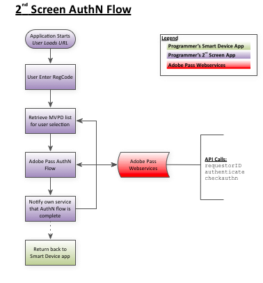

# REST API Cookbook (client-naar-server) {#rest-api-cookbook-client-to-server}

>[!NOTE]
>
>De inhoud op deze pagina wordt alleen ter informatie verstrekt. Voor het gebruik van deze API is een huidige licentie van Adobe vereist. Ongeautoriseerd gebruik is niet toegestaan.

## Overzicht {#overview}

Dit document bevat stapsgewijze instructies voor het engineeringteam van een programmeur om een &quot;slim apparaat&quot; te integreren (spelconsole, smart TV-app, set top box, enz.) met Adobe Primetime-verificatie met REST API-services. Deze client-naar-server-benadering, die REST APIs eerder dan een cliënt SDK gebruikt, staat voor bredere steun van verschillende platforms toe waarvoor het ontwikkelen van een significant aantal unieke SDKs niet uitvoerbaar zou zijn. Voor een breed technisch overzicht van hoe de oplossing zonder clips werkt, raadpleegt u de [Klantloos technisch overzicht](/help/authentication/rest-api-overview.md).

Deze aanpak vereist twee componenten (streaming app en AuthN app) om de vereiste stromen te voltooien: opstarten, registreren, autoriseren en weergavemedia in de streaming app en de verificatiestroom in uw AuthN-app.

## Componenten {#components}

In een werkende cliënt-aan-server oplossing zijn de volgende componenten betrokken:

 

| Type | Component | Beschrijving |
| --- | --- | --- |
| Streaming apparaat | Streaming-app | De toepassing van de Programmer die op het het stromen apparaat van de gebruiker verblijft en voor authentiek verklaarde video speelt. |
|  | \[Optioneel\] AuthN-module | als het Streamen Apparaat een Agent van de Gebruiker (d.w.z. Browser van het Web) heeft, is de Module AuthN verantwoordelijk voor het voor authentiek verklaren van de gebruiker op MVPD IdP. |
| \[Optioneel\] AuthN-apparaat | AuthN App | als het Streaming Apparaat geen Agent van de Gebruiker (d.w.z. Browser van het Web) heeft, is de Toepassing AuthN een Toepassing van het Web van de Programmer die van een afzonderlijk apparaat van de gebruiker gebruikend Webbrowser wordt betreden.  |
| Adobe-infrastructuur | Adobe Pass Service | De dienst die met de Dienst MVPD IdP en AuthZ integreert en authentificatie en vergunningsbesluiten verstrekt. |
| MVPD-infrastructuur | MVPD IdP | Een eindpunt MVPD dat op referentie-gebaseerde authentificatiedienst verleent om de identiteit van hun gebruiker te bevestigen. |
|  | MVPD AuthZ Service | Een eindpunt MVPD dat vergunningsbesluiten verstrekt die op de abonnementen van de gebruiker, ouderlijke controles, enz. worden gebaseerd. |

 

Aanvullende termen die in de flow worden gebruikt, worden gedefinieerd in de [Verklarende woordenlijst](/help/authentication/glossary.md).

## Stromen{#flows}

### Dynamische clientregistratie (DCR)

Adobe Pass gebruikt DCR om clientcommunicatie tussen een programmeur-toepassing of -server en de Adobe Pass-services te beveiligen. De DCR-stroom is afzonderlijk, afhankelijk en in de voorwaarde gesteld en is te vinden in [Dynamische clientregistratie](/help/authentication/dynamic-client-registration.md)

### Streaming (slim apparaat) App Flows

#### Stroom opstarten

1. Uw app start en laadt de eerste gebruikersinterface.

2. Vraag een apparaat-id op of genereer deze.

3. Geef een vraag van de Controle-authentificatie uit om te zien of is het apparaat reeds voor authentiek verklaard.  Bijvoorbeeld: [`<SP_FQDN>/api/v1/checkauthn [device ID]`](/help/authentication/check-authentication-token.md)

4. Als de `checkauthn` De vraag slaagt, gaat aan de Stroom van de Vergunning vanaf Stap 2 te werk.  Start de Registratiestroom als dit mislukt.

 

#### Registratiestroom

1. U krijgt een registratiecode en URL waarmee uw gebruiker toegang krijgt tot de tweede toepassing voor schermaanmelding en u kunt deze aan de gebruiker presenteren:

   a. Verzend een verzoek van de POST naar de Dienst van de Code van de Registratie van de Adobe, die een gehakt apparatenidentiteitskaart en een &quot;Registratie URL&quot;overgaat.  Bijvoorbeeld: [`<REGGIE_FQDN>/reggie/v1/[requestorId]/regcode [device ID]`](/help/authentication/registration-code-request.md)

   b. De geretourneerde registratiecode en URL presenteren aan de gebruiker.

   c. Geef de gebruiker de opdracht om naar een apparaat te schakelen dat geschikt is voor internet, naar de URL te navigeren en vervolgens de registratiecode in te voeren.

 

#### Autorisatiestroom

1. De gebruiker keert van het tweede scherm terug app en drukt op de &quot;Doorgaan&quot; knoop op uw apparaat. Alternatief, kon u een opiniepeilingsmechanisme uitvoeren om de authentificatiestatus te controleren, maar de authentificatie van Adobe Primetime adviseert de Doorgaan knoopmethode over opiniepeiling. <!--(For information on employing a "Continue" button versus polling the Adobe Primetime authentication backend server, see the Clientless Technical Overview: Managing 2nd-Screen Workflow Transition.)--> Bijvoorbeeld: [\&lt;sp _fqdn=&quot;&quot;>/api/v1/tokens/authoring](/help/authentication/retrieve-authentication-token.md)

2. Verzend een verzoek van de GET naar de de authentificatievergunningsdienst van Adobe Primetime om vergunning in werking te stellen. Bijvoorbeeld: `<SP_FQDN>/api/v1/authorize [device ID, Requestor ID, Resource ID]`

<!-- end list -->

* Als de reactie op succes wijst: De gebruiker heeft een geldig teken AuthN EN de gebruiker wordt gemachtigd om de gevraagde media (er is een geldig teken AuthZ voor deze gebruiker) te letten.

* Als de reactie op een fout wijst: Onderzoek de geworpen Uitzondering om zijn type (AuthN, AuthZ, of iets anders) te bepalen:

   * Als het een fout AuthN was dan herstart de Stroom van de Registratie.

   * Als het een AuthZ-fout was, is de gebruiker niet geautoriseerd om de gevraagde media te bekijken en moet een foutbericht worden weergegeven aan de gebruiker.

   * Als er een andere fout is opgetreden (verbindingsfout, netwerkfout, enz.) geeft u vervolgens een geschikt foutbericht weer aan de gebruiker.

 

#### Media-stroom weergeven

1. Mediakeuzen presenteren. De gebruiker selecteert de media die u wilt weergeven.

2. Zijn de media beveiligd?

   a. Uw app controleert of de media is beveiligd.

   b. Als de media is beveiligd, start uw app de bovenstaande workflow voor autorisatie (AuthZ).

   c. Als de media niet is beveiligd, kunt u de media voor de gebruiker afspelen.

3. De media afspelen.

### AuthN (tweede scherm) App Flow

1. Krijg een lijst van MVPDs voor deze gebruiker. Bijvoorbeeld: [`<SP_FQDN>/api/v1/config/[requestorID]`](/help/authentication/provide-mvpd-list.md)

1. Start de verificatiestroom.  Bijvoorbeeld: [`<SP_FQDN>/api/v1/authenticate [requestorID, MVPD ID, Redirect URL, Domain name, Registration Code, "noflash=true"]`](/help/authentication/initiate-authentication.md)

1. Controleer of de verificatie is gelukt. Bijvoorbeeld:[`<SP_FQDN>/api/v1/checkauthn/[registration code][requestor ID]`](/help/authentication/check-authentication-token.md)

1. Stuur de gebruiker terug naar de toepassing van het slimme apparaat om de autorisatiestroom te voltooien.

## Platform SSO {#platform-sso}

Sommige platforms bieden specifieke ondersteuning voor Single Sign-On (SSO). De implementatiedetails zijn te vinden voor elk platform:

* [Apple SSO](/help/authentication/apple-sso-cookbook-rest-api.md)
* Amazon SSO

## TempPass en Promotional TempPass voor REST API {#temppass}

Voor TempPass- en Promotional TempPass-implementaties waarbij de gebruiker geen referenties hoeft in te voeren, kan verificatie rechtstreeks worden geïmplementeerd in de streamingtoepassing.

**Voor het gebruik van deze API moet de Streaming App de unieke id van het apparaat controleren zoals deze wordt gebruikt voor het identificeren van het token, samen met de optionele extra gegevens.**

