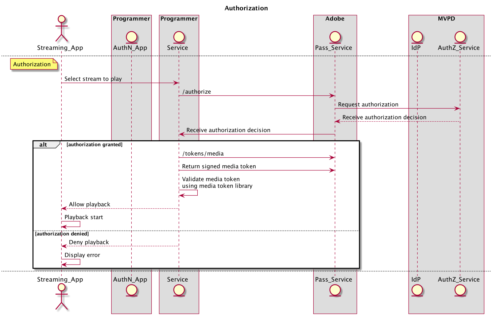

# REST API Cookbook (Server-to-Server) {#rest-api-cookbook-server-to-server}

>[!NOTE]
>
>De inhoud op deze pagina wordt alleen ter informatie verstrekt. Voor het gebruik van deze API is een huidige licentie van Adobe vereist. Ongeautoriseerd gebruik is niet toegestaan.

## Overzicht {#overview}

Het doel van dit kookboekdocument is om beste praktijken voor het uitvoeren van de Authentificatie van Adobe Primetime te detailleren gebruikend de server-aan-Server architectuur.  Het verstrekt basisvereisten, geleidelijke stroomimplementatie en algemene overwegingen voor productiemilieu&#39;s en verrichting.

## Componenten {#components}

In een werkende server-aan-server oplossing zijn de volgende componenten betrokken:

| Type | Component | Beschrijving |
| --- | --- | --- |
| Streaming apparaat | Streaming-app | De programmeertoepassing die op het het stromen apparaat van de gebruiker verblijft en voor authentiek verklaarde video speelt. |
| | \[Optioneel\] AuthN-module | als het Streamen Apparaat een Agent van de Gebruiker (d.w.z. Browser van het Web) heeft, is de Module AuthN verantwoordelijk voor het voor authentiek verklaren van de gebruiker op MVPD IdP. |
| \[Optioneel\] AuthN-apparaat | AuthN App | als het Streaming Apparaat geen Agent van de Gebruiker (d.w.z. Browser van het Web) heeft, is de Toepassing AuthN een Toepassing van het Web van de Programmer die van een afzonderlijk apparaat van de gebruiker gebruikend Webbrowser wordt betreden. |
| Programmeringsinfrastructuur | Programmeringsservice | Een service die het streamingapparaat koppelt aan de Adobe Pass-service om verificatie- en autorisatiebeslissingen te verkrijgen. |
| Adobe-infrastructuur | Adobe Pass Service | De dienst die met de Dienst MVPD IdP en AuthZ integreert en authentificatie en vergunningsbesluiten verstrekt. |
| MVPD-infrastructuur | MVPD IdP | Een eindpunt MVPD dat op referentie-gebaseerde authentificatiedienst verleent om de identiteit van hun gebruiker te bevestigen. |
| | MVPD AuthZ Service | Een eindpunt MVPD dat vergunningsbesluiten verstrekt die op de abonnementen van de gebruiker, ouderlijke controles, enz. worden gebaseerd. |

Aanvullende termen die in de flow worden gebruikt, worden gedefinieerd in de
[Verklarende woordenlijst](/help/authentication/glossary.md).

## Stromen {#flows}

### Dynamische clientregistratie (DCR)

Adobe Pass gebruikt DCR om clientcommunicatie tussen een programmeertoepassing of server en de Adobe Pass-services te beveiligen. De DCR-stroom is afzonderlijk, afhankelijk en in de voorwaarde gesteld en is te vinden in [Dynamische clientregistratie](/help/authentication/dynamic-client-registration.md).

### Verificatie (authN)

De authentificatiestroom wordt gebruikt om een gebruiker toe te staan om zich aan hun MVPD te identificeren om te bepalen of de gebruiker een geldige rekening heeft.

1. De gebruiker start de Streaming Device-app en probeert zich aan te melden of beveiligde inhoud weer te geven.
2. De toepassing Streaming Device (Streaming Device) vraagt de programmeerservice of het apparaat al is geverifieerd.
3. De programmeerservice registreert de toepassing met DCR.
4. De programmeerservice controleert de audiostatus van het streamingapparaat door de Adobe Pass-service aan te roepen **controletechnicus** API.
5. Voor het geval waarin **controletechnicus** De vraag keert de status terug dat het Apparaat van de Gebruiker voor authentiek wordt verklaard, dan kan app aan de stroom van de Vergunning te werk gaan.
6. Voor het geval waarin **controletechnicus** De vraag keert de status terug dat het Apparaat van de Gebruiker NIET voor authentiek wordt verklaard, dan zou de app op een gebruikersverzoek moeten wachten login.
7. Wanneer de gebruiker om direct login (b.v. selecteert login knoop) of onrechtstreeks login (b.v. selecteert beschermde inhoud wanneer niet reeds voor authentiek verklaard), doet de Streaming Apparaat app een verzoek aan de Dienst van de Programmer om gebruikersauthentificatie in werking te stellen. De Programmer Service vraagt en ontvangt een unieke registratiecode (regcode) door de Adobe Pass-service aan te roepen **herschrijven** API.
8. De dienst van de Programmer wint ook de lijst van huidige MVPDs en attributen terug door de Dienst van Adobe Pass te roepen **config** API. Opmerking: deze API kan ook eerder in de flow en cache worden aangeroepen.
9. De programmeerservice retourneert de regcode naar de app Streaming Device en de verwerkte MVPD-lijst die is aangevraagd in stap \#7. Opmerking: de verwerkte MVPD-lijstindeling wordt opgegeven door de programmeur en kan worden gefilterd om specifieke MVPD&#39;s (dat wil zeggen allow- of block-lists) expliciet toe te staan of te blokkeren.
10. Als het apparaat van AuthN (d.w.z. &quot;tweede scherm&quot;), of door keus of behoefte (d.w.z. het Streaming Apparaat steunt geen Agent van de Gebruiker) verschillend is, dan zou het Streaming Apparaat de regcode en URI voor de gebruiker moeten tonen om tot de Toepassing van AuthN toegang te hebben. De gebruiker typt URI in de Agent van de Gebruiker op het Apparaat AuthN om de Toepassing te lanceren AuthN, en typt dan regcode in die toepassing. Als het Streaming Apparaat het zelfde als het Apparaat AuthN is, dan kan regcode programmatically tot de Module worden overgegaan AuthN.
11. De module AuthN stelt de gebruikersauthentificatie met MVPD door een Plukker te tonen MVPD in werking. Nadat de gebruiker MVPD selecteert, de vraag van de Module van AuthN **authenticate** met regcode, die de Agent van de Gebruiker aan MVPD IdP opnieuw richt. Wanneer de gebruiker met succes met MVPD voor authentiek verklaart, wordt de Agent van de Gebruiker opnieuw gericht terug door de Dienst van Adobe Pass, waar de succesvolle authentificatie met regcode wordt geregistreerd, en dan opnieuw gericht terug naar de Module AuthN.
12. Als het streamingapparaat verschilt van het AuthN-apparaat, geeft het AuthN-apparaat een succesvol verificatiebericht weer aan de gebruiker en worden de stappen uitgevoerd (bijvoorbeeld &quot;Success\!! U kunt nu terugkeren naar uw gameconsole om door te gaan met \[..\]&quot;). Als het streamingapparaat hetzelfde is als het AuthN-apparaat, kan het streamingapparaat de voltooiing van de verificatie programmatisch detecteren.

Het volgende diagram illustreert de authentificatiestroom:

### Autorisatie (authZ)

De machtigingsstroom wordt gebruikt om te bepalen of een gebruiker toegang heeft tot gevraagde inhoud.

1. Telkens wanneer de gebruiker beveiligde inhoud probeert te bekijken op de Streaming Device-app, roept de Streaming Device-app de Programmer Service aan om de inhoud te identificeren en om toestemming en informatie te vragen die nodig zijn om de stream te starten.
1. De programmeerservice roept de Adobe Pass **autoriseren** API die de Resource ID samen met andere vereiste parameters doorgeeft. De dienst van Adobe roept de Dienst MVPD AuthZ met identiteitskaart van het Middel en ontvangt en vergunningsbesluit dat dan aan de Dienst van de Programmer wordt overgegaan. Dit vergunningsbesluit zal door de Dienst van Adobe Pass voor een configureerbare periode in het voorgeheugen ondergebracht worden. Bij volgende **autoriseren** de vraag van de Dienst van de Programmer aan de Dienst van Adobe Pass, zal de caching waarde zijn teruggekeerd zolang het geldig is.
1. Als de toestemming is verleend, moet de programmeerdienst de Adobe Pass bellen **/tokens/media** API, die een ondertekend media-token retourneert. De programmeerservice moet het mediatoken valideren met behulp van de JAR (Media Token Verifier Library). Indien geldig, zou de Dienst van de Programmer toestemming en nodig moeten terugkeren om de stroom (b.v. stroom URL) te beginnen die in stap \#1 wordt gevraagd.
1. Indien de vergunning wordt geweigerd, **autoriseren** De vraag zal een foutencode en een beschrijving aan de Dienst van de Programmer terugkeren. De dienst van de Programmer zou de foutencode en de beschrijving (of een programma gewijzigd bericht) aan het verzoek in stap \#1 moeten terugkeren.

In het volgende diagram wordt de stroom van de autorisatie weergegeven:

### Afmelden

Met de afmeldingsstroom kan een gebruiker de identiteit verwijderen die momenteel aan de toepassing is gekoppeld.

1. Wanneer de gebruiker om logout (d.w.z. verwijder van het apparaat de huidige rekening MVPD verbonden aan de toepassing) verzoekt, roept het Streaming Apparaat app de Dienst van de Programmer die het vertelt om het apparaat te logout.
1. De programmeerservice moet de Adobe Pass **afmelden** API.

Het volgende diagram illustreert de logout flow:

### \[Optioneel\] Voorafgaande toestemming (ook bekend als voor de vlucht)

Voortoestemming kan worden gebruikt om van een reeks middelen snel te bepalen degenen een gebruiker toegang zou kunnen hebben.  Het resultaat van deze vraag wordt typisch gebruikt om UI voor een individuele gebruiker aan te passen.

1. Zodra de gebruiker voor authentiek wordt verklaard, kan het Steaming Apparaat de Dienst van de Programmer roepen om de inhoud te verzoeken waarop de gebruiker gerechtigd is te stromen.

1. De programmeerservice moet de Adobe Pass **preautoriseren** API met een lijst van Middel IDs, die een eenvoudige koord zijn dat typisch een kanaal vertegenwoordigt een gebruiker aan stroom zou kunnen gerechtigd zijn. *Opmerking: momenteel wordt de* ***preautoriseren*** *de vraag wordt gevormd om de lijst tot vijf (5) Identiteitskaart van het Middel te beperken. Wanneer meer dan vijf middelen worden vereist, veelvoudige* ***preautoriseren*** *De vraag kan worden gemaakt, of de vraag kan worden gevormd om meer dan vijf middelen met een overeenkomst van MVPDs goed te keuren. Implementatoren dienen rekening te houden met de kosten van een* ***preautoriseren*** *zowel de middelen MVPD als de reactietijd aan de Programmer roepen en hun gebruik van de vraag zorgvuldig structureren.*

1. De **preautoriseren** De vraag zal aan de Dienst van de Programmer met een voorwerp JSON antwoorden die een WAAR of waarde FALSE voor elke identiteitskaart van het Middel in het verzoek bevatten die erop wijst of de gebruiker op het bijbehorende kanaal of niet recht heeft. *Nota: Als een MVPD geen antwoord voor een bepaalde identiteitskaart van het Middel (b.v. wegens netwerkfouten of onderbrekingen) verstrekt, zal de waarde aan VALS in gebreke blijven.*

1. De programmeerdienst moet de **preautoriseren** De vraagreactie om een programmeur-bepaalde douanerespons aan het Streaming Apparaat tot stand te brengen, typisch om de presentatie aan de gebruiker te personaliseren die op hun rechten wordt gebaseerd.

In het volgende diagram wordt de stroom voorafgaand aan de autorisatie weergegeven:

### Metagegevens \[optioneel\]

De meta-gegevens kunnen worden gebruikt om gebruikersinformatie terug te winnen die door MVPD wordt gedeeld.
Voorbeelden hiervan kunnen gebruikers-id, postcode enzovoort zijn.

1. Zodra de gebruiker voor authentiek wordt verklaard, kan de Dienst van de Programmer de Adobe Pass roepen **gebruikersmetagegevens** API om informatie over de geverifieerde gebruiker te vragen.

1. De reactie omvat alle metagegevens die beschikbaar zijn voor de opgegeven gebruiker. De specifieke gebieden worden gevormd afzonderlijk voor elke integratie Programmer/MVPD.

In het volgende diagram wordt de stroom voorafgaand aan de autorisatie weergegeven:

## Omgevingen en functionele vereisten{#environments}

Een programmeur moet ten minste twee omgevingen maken: een voor productie en een of meer voor staging.

### Productie

De productieomgeving moet in hoge mate beschikbaar zijn en op passende wijze worden geschaald voor grote of onverwachte pieken (bv. live sport, baanbrekend nieuws).

De Adobe Pass-service wordt uitgevoerd op meerdere datacenters die geografisch over de hele VS zijn verspreid.  Om de beste reactietijd (d.w.z. laagste latentie) van de dienst van Adobe Pass te bereiken, zou de programmeur ook een gelijkaardige geografisch verspreide de dienstinfrastructuur moeten creëren.

De dienst van de Programmer zou het DNS geheime voorgeheugen tot maximaal 30 s moeten beperken voor het geval de Adobe verkeer moet terugleiden. Dit kan zich voordoen als een datacenter niet beschikbaar is.

De programmeur zou de openbare IP waaier van het productiemilieu moeten verstrekken. Deze zullen in een toegestane lijst van IPs in de infrastructuur van Adobe Pass voor toegang worden ingegaan en door het Fair API gebruiksbeleid van Adobe worden beheerd.

### Staging

De het opvoeren omgeving kan minimaal zijn, maar zou alle systeemcomponenten en bedrijfslogica moeten omvatten. Het moet op dezelfde wijze functioneren als de productie en het moet mogelijk maken om emissies buiten de productie te testen. In het ideale geval kan de testomgeving worden verbonden met de Adobe Pass-testomgevingen voor gebruik door de programmeur en door Adobe wanneer dat nodig is, zodat we hulp kunnen bieden bij het testen en oplossen van problemen.

### Functionele vereisten

De dienst van de Programmer moet nauwkeurige apparatenidentificatieinformatie over het apparaat overgaan waarvoor zij de stromen uitvoeren. Bovendien, moet de dienst van de Programmer IP van het apparaat overgaan waarvoor zij de stromen (in x-door:sturen-voor kopbal) samen met de haven van de verbindingsbron (op het gebied van apparateninfo) uitvoeren:

    **X-Forwarded-For: \&lt;client _ip=&quot;&quot;>**
    
    waar \&lt;client _ip=&quot;&quot;> is het openbare IP van de cliënt adres
    
    
    
    De header moet worden toegevoegd aan **regcode**- en **autoriseren**-aanroepen
    
    Voorbeelden:
    
    POST /reggie/v1/{req\_id}/regcode HTTP/1.1
    
    X-Forwarded-For:203.45.101.20
    
    
    
    GET /api/v1/authorize HTTP/1.1
    
    X-Forwarded-For:203.45.101.20

De dienst van de Programmer zou gegevens en het formatteren moeten verzenden die door individuele MVPDs of geïntegreerde apps (b.v. apparaat IP, bronhaven, apparateninformatie, MRSS, facultatieve gegevens zoals ECID) worden vereist. <!--Please see the documentation for [Passing Device and Connection Information Cookbook](http://tve.helpdocsonline.com/passing-device-information-cookbook)-->.

De dienst van de Programmer moet authN en authZ TTLs respecteren wanneer het caching en maakt authN of authZ zittingen onbruikbaar wanneer op de hoogte gebracht.

De programmeur moet certificaten onderhouden die met Adobe worden gedeeld.

<!--
## Related Information {#related}

* [REST API Reference](/help/authentication/rest-api-reference.md)
* [Glossary of Terms](/help/authentication/adobe-pass-glossary.md)
-->
