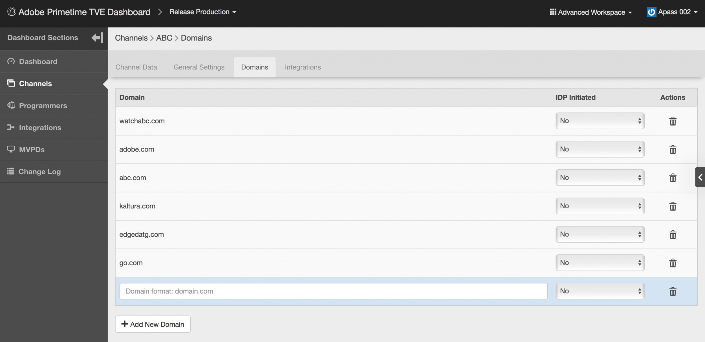

# Gebruikershandleiding voor Primetime TVE-dashboard {#tve-db-user-guide}

>[!NOTE]
>
>De inhoud op deze pagina wordt alleen ter informatie verstrekt. Voor het gebruik van deze API is een huidige licentie van Adobe vereist. Ongeautoriseerd gebruik is niet toegestaan.

## Inleiding {#tve-db-intro}

[[!DNL Adobe] TVE-dashboard (TVE-dashboard)](https://console.auth.adobe.com/) is een zelfbedieningsdashboard dat is bedoeld voor gebruikers die werken voor mediabedrijven (programmeurs) die een zakelijke relatie hebben met het Adobe Primetime Authentication-productteam.

Neem contact op met uw technische accountmanager (TAM) voor toegang. Als u toegang wilt krijgen, moet u twee nieuwe gebruikersgroepen configureren in uw Adobe Marketing Cloud-organisatie:

* TVE-dashboard lezen-schrijven - de leden van deze groep hebben volledige rechten voor alle bewerkbare gedeelten van het dashboard
* Alleen-lezen TVE-dashboard - de leden van deze groep hebben alleen weergaverechten voor het hele dashboard

Voordat u deze gebruikershandleiding dieper ingaat, raden we u aan de volgende bronnen te raadplegen om een goed inzicht te krijgen in de stromen en functies die worden aangeboden door het productteam van Adobe Primetime Authentication en om vertrouwd te raken met de termen die worden gebruikt in dit document:

* [TVE - Technisch document](/help/authentication/technical-paper.md)
* [Programmer Kickstart Guide](/help/authentication/programmer-kickstart-guide.md)
* [Entitlement Flow](/help/authentication/entitlement-flow.md)
* [Verklarende woordenlijst](/help/authentication/glossary.md)

Vervolg aan de volgende secties van deze gebruikershandleiding, zult u manieren ontdekken om verschillende montages voor de Kanalen van uw bedrijf, Programma&#39;s of de Integraties tussen Kanalen en MVPDs (Multichannel Video Programma Distributors) te beheren.

>[!IMPORTANT]
>TVE-dashboard biedt de mogelijkheid om te schakelen tussen een standaardwerkruimte en een geavanceerde werkruimte. U kunt dit doen door het pictogram in de rechterbovenhoek in- of uit te schakelen. De geavanceerde werkruimte is gericht op gebruikers met uitgebreide technische kennis en met geavanceerde kennis van de functies die worden aangeboden door het productteam voor Adobe Primetime-verificatie.

*Afbeelding 1: De vervolgkeuzelijst Adobe Primetime TVE-dashboard &quot;Basic / Advanced Workspace&quot;*

## Omgevingen {#authn-environments}

Afhankelijk van de taken die een gebruiker mogelijk moet uitvoeren, moet hij of zij mogelijk schakelen tussen Adobe Primetime-verificatieomgevingen. Raadpleeg het volgende document voor meer informatie over de Adobe Primetime-verificatieomgevingen: [Werken met Adobe Primetime-verificatieomgevingen](/help/authentication/understanding-the-adobe-environments.md).

Het Dashboard van TVE verstrekt twee milieu&#39;s genoemd Prequal (Prequalification) en Versie, elk met twee profielen genoemd Staging en Productie, zoals hieronder getoond:

* [Periodieke stapeling](https://console-prequal.auth-staging.adobe.com/)
* [Prequente productie](https://console-prequal.auth.adobe.com/)
* [Staging vrijgeven](https://console.auth-staging.adobe.com/)
* [Geen productie](https://console.auth.adobe.com/)

Om tussen milieu&#39;s te schakelen, kan de gebruiker op het gewenste milieu klikken dat door de ingang van het drop-down hieronder afgebeelde element wordt vertegenwoordigd:

*Afbeelding 2: vervolgkeuzelijst voor Adobe Primetime TVE-dashboardomgevingen*

>[!IMPORTANT]
>Het is zeer belangrijk om op te merken dat wanneer het aanbrengen van administratieve veranderingen in uw configuratie van de Authentificatie van Adobe Primetime door het Dashboard van TVE, wij u sterk adviseren om de hieronder opeenvolging te volgen om correcte functionaliteit te verzekeren.

Beheerwijzigingen aanbrengen in uw Adobe Primetime-verificatieconfiguratie via het TVE-dashboard:

* Wijzigingen uitvoeren in [Staging vrijgeven en valideren](http://sp.auth-staging.adobe.com/apitest/api.html).
* Wijzigingen uitvoeren in [Prequente productie en validatie hiervan](http://sp.auth-staging.adobe.com/apitest/api.html).
* Wijzigingen uitvoeren in [Productie vrijgeven en valideren](http://sp.auth-staging.adobe.com/apitest/api.html).

>[!IMPORTANT]
>Voor de administratieve veranderingen om levend te gaan, moeten de gebruikers aan de &quot;Overzicht en de Duw sectie van Veranderingen&quot;door de knoop te selecteren, die in het bodem-linkergedeelte van sidebar zal verschijnen, om veranderingen te herzien, een beschrijving voor de pas gecreëerde veranderingen toe te voegen en de configuratieupdate te bevestigen door &quot;de Duw Configuratie&quot;te selecteren.

*Afbeelding 3: De Adobe Primetime TVE-dashboardrevisie en pushmelding*

## Secties {#sections}

Gebruikers die werken voor mediabedrijven (programmeurs) hebben via het zijpaneel toegang tot de volgende gedeelten van het TVE-dashboard:

* **Kanalen** - Bevat instellingen voor inhoudsproviders
* **Programmeurs** - Bevat instellingen die betrekking hebben op een of meer bovenliggende organisaties **Kanalen**
* **Integraties** - Bevat instellingen die betrekking hebben op de integratie tussen **Kanalen** en **MVPD&#39;s**
* **MVPD&#39;s** - Bevat instellingen die betrekking hebben op de beschikbare **MVPD&#39;s**
* **Rapporten** - Bevat geaggregeerde gegevens voor drie soorten rapporten: AuthN TTL, AuthZ TTL, SSO
* **Logbestand wijzigen** - Bevat de meest recente wijzigingen die zijn toegepast op de TVE-dashboardconfiguratie

*Afbeelding 4: De Adobe Primetime TVE-dashboardsecties*

### Kanalen {#tve-db-channels-section}

In deze sectie kunt u instellingen voor beschikbare kanalen weergeven en bewerken of een nieuwe kanaal maken. Wanneer u op een van de beschikbare kanalen klikt, wordt een scherm met de volgende tabbladen weergegeven:

* **Kanaalgegevens**
   * **Kanaal-id** - De unieke id van het kanaal die in ons systeem wordt gebruikt, ook wel &quot;aanvraag-id&quot; genoemd.
   * **Weergavenaam** - De handelsnaam van Channel.
* **Algemene instellingen**
   * **Analyseconfiguratie** - Configureer Adobe Primetime-verificatiegebeurtenissen die naar Adobe Analytics moeten worden doorgestuurd. Gelieve te contacteren Adobe voor meer details over hoe identiteitskaart van de Reeks van het Rapport (RSID) moet worden gevormd alvorens deze eigenschap toe te laten.
* **Certificaten**

  Bevat de lijst van certificaten die in de authentificatiestroom naast hun het uitgeven organisatie, het uitgeven datum en vervaldatum worden gebruikt. Deze certificaten fungeren als openbare/persoonlijke sleutels en worden gebruikt voor validatiedoeleinden.
* **Domeinen**

  Bevat de lijst van domeinen waarvan het respectieve Kanaal met de Authentificatie van Adobe Primetime zal communiceren.
* **Integraties**

  Bevat de lijst van integraties met beschikbare MVPDs, naast de status van elke integratie die zou kunnen worden toegelaten of niet. Navigeren naar de pagina Integratie is beschikbaar door op een specifieke vermelding te klikken.
* **Geregistreerde toepassingen**

  Bevat de lijst met toepassingsregistraties. Raadpleeg het document voor meer informatie [Dynamisch clientregistratiebeheer](/help/authentication/dynamic-client-registration-management.md).

* **Aangepaste schema&#39;s**

  Bevat de lijst met aangepaste schema&#39;s. Zie voor meer informatie [iOS/tvOS-toepassingsregistratie](/help/authentication/iostvos-application-registration.md) en [Dynamisch clientregistratiebeheer](/help/authentication/dynamic-client-registration-management.md)

#### Domeinen toevoegen/verwijderen {#add-delete-domains}

Als u een nieuw domein voor het geselecteerde kanaal wilt toevoegen, klikt u op de knop Nieuw domein toevoegen onder de lijst Domeinen. Hiermee wordt een nieuw domeinitem gemaakt waarin u de domeinnaam kunt opgeven. Als er al een generischer domein bestaat in de lijst met domeinen, moet u geen nieuw subdomein toevoegen.

*Afbeelding: Tabblad Domeinen in kanalen*

### Programmeurs {#tve-db-programmers-section}

In deze sectie kunt u instellingen weergeven en bewerken voor beschikbare programmeurs of een nieuwe maken. Wanneer u op een van de beschikbare programmeurs klikt, wordt een scherm met de volgende tabbladen weergegeven:

* **Programmeringsgegevens**
   * **Programma-id** - De unieke id van de programmeur die in ons systeem wordt gebruikt.
   * **Weergavenaam** - De handelsnaam van de programmeur.
   * **Logo URL** - Het commerciële logo van de programmeur, de eenvormige resource locator (URL).
   * **Voorvertoning logo** - De voorvertoning van het commerciële logo van de programmeur door deze te downloaden vanaf de bovenstaande URL (Uniform Resource Locator).

* **Certificaten**

  Bevat de lijst van certificaten die in de authentificatiestroom naast hun het uitgeven organisatie, het uitgeven datum en vervaldatum worden gebruikt. Deze certificaten fungeren als openbare/persoonlijke sleutels en worden gebruikt voor validatiedoeleinden.

* **Kanalen**

  Bevat de lijst met kanalen die bij deze specifieke programmeur horen. U kunt navigeren naar de sectie Kanalen door op een bepaald item te klikken.

* **Geregistreerde toepassingen**

  Bevat de lijst met toepassingsregistraties. Zie voor meer informatie [Dynamisch clientregistratiebeheer](/help/authentication/dynamic-client-registration-management.md).

* **Aangepaste schema&#39;s**

  Bevat de lijst met aangepaste schema&#39;s. Zie voor meer informatie [iOS/tvOS-toepassingsregistratie](/help/authentication/iostvos-application-registration.md) en [Dynamisch clientregistratiebeheer](/help/authentication/dynamic-client-registration-management.md).

### Integraties {#tve-db-integrations-sec}

Deze sectie staat het bekijken en het uitgeven montages voor integratie tussen Kanalen en beschikbare MVPDs of het creëren van nieuwe toe. Als u op een van de beschikbare integraties klikt, wordt één pagina geretourneerd wanneer u de basiswerkruimte gebruikt of een scherm met de volgende tabbladen wanneer u de geavanceerde werkruimte gebruikt:

* **Integratiegegevens**
   * **Integratie-id**- Het resultaat van het toevoegen van unieke id van MVPD aan unieke identiteitskaart van het Kanaal die door &quot;_&quot;karakter wordt gescheiden.
   * **Weergavenaam kanaal** - De handelsnaam van Channel.
   * **Kanaal-id** - De unieke id van het kanaal die in ons systeem wordt gebruikt, ook wel &quot;aanvraag-id&quot; genoemd.
   * **Weergavenaam MVPD** - de handelsnaam van het MVPD.
   * **MVPD-id** - De unieke id van de MVPD die in ons systeem wordt gebruikt.
* **Algemene instellingen**
   * **Metagegevenstoetsen gebruiker** - Configureer metagegevenssleutels die beschikbaar zijn voor de specifieke integratie.
   * **Platformspecifieke instellingen** - Vorm verschillende montages aan een specifiek platform (bijvoorbeeld, TTLs, SSO, en IFrames).

* **Verificatie-instellingen**
   * Bevat instellingen die verwant zijn aan de Adobe Primetime-verificatiefunctie.
* **Autorisatie-instellingen**
   * Bevat instellingen die betrekking hebben op de autorisatiefunctie voor Adobe Primetime-verificatie.
* **Afmeldingsinstellingen**
   * Bevat instellingen die verwant zijn aan de functie voor het afmelden van Adobe Primetime-verificatie.

#### Integratie maken {#create-integration}

Volg onderstaande stappen om een nieuwe integratie tot stand te brengen:

* Klik op de knop Nieuwe integratie toevoegen
* zoeken en een kanaal selecteren
* zoeken en een MVPD selecteren
* wachten op Dashboard van TVE om &quot;Integratie ID&quot;te berekenen en de beschikbare eindpunten van MVPD te tonen
* selecteer authentificatie, vergunning en logout eindpunten of gebruik de standaardwaarden
* klik op de knop Integratie maken
* afhankelijk van de montages MVPD een popup kan verschijnen en om extra eigenschappen vragen, die door MVPD vooraf zouden moeten worden verstrekt, anders zal een omleiding aan de pas gecreëerde integratiepagina plaatsvinden

*Figuur 5. Het venster Nieuwe integratie van het Adobe Primetime TVE-dashboard*

#### Integratie bijwerken {#update-integration}

Als u een bestaande integratie wilt bijwerken, klikt u op de tabelvermelding voor die specifieke integratie vanuit de sectie Integraties of de sectie Kanalen, die een tabblad Integraties bevat.

Wanneer het gebruiken van de Basiswijze van de Werkruimte, zal deze sectie het zien van en het uitgeven van de meest algemeen bijgewerkte montages, zoals authentificatie en toestemmingstoken TTLs (tijd-aan-levende), evenals iFrame montages toestaan. Houd er rekening mee dat er TTL-instellingen kunnen ontbreken voor de integratie met MVPD&#39;s die dynamisch gedefinieerde Token Persistence TTL ondersteunen (zie item 1.19 van [Vereisten voor MVPD-integratie](/help/authentication/mvpd-integr-features.md)).

Als u de modus Geavanceerd werkgebied gebruikt, kunt u in deze sectie minder algemene instellingen bekijken en bewerken.

In het geval van zowel de modi Standaard als Geavanceerd van de werkruimte, kunnen deze instellingen op platformniveau worden gewijzigd (selecteer bijvoorbeeld een aangepaste waarde voor het teken voor de machtiging-TTL op Android, standaard op elk ander platform).

>[!IMPORTANT]
>Het is belangrijk om de ketting van de montageenovererving te begrijpen: MVPD -> Eindpunt MVPD -> Integratie -> Platform, waar Platform de meest specifieke waarde en MVPD de meest generische gebrek heeft.

*Figuur 6. De eigenschapoverervingsketen van de Adobe Primetime TVE-dashboard*

#### Platformspecifieke instellingen {#platform-sp-settings}

Deze subsectie kan worden gebruikt om de montages voor specifieke platforms met voeten te treden. De beschikbare platforms zijn:

* **Alle platforms** - Stel waarden in die op alle platforms worden toegepast, ongeacht de programmeerimplementaties voor het geval er geen andere waarden zijn ingesteld voor een bepaald platform.
* **Android** - Stel waarden in die op de programmeerimplementaties worden toegepast via de Adobe Primetime Authentication Android SDK.
* **REST-API zonder client** - Stel waarden in die op de programmeerimplementaties worden toegepast via de Adobe Primetime Authentication REST API.
* **Fire TV** - Stel waarden in die op de programmeerimplementaties worden toegepast via Adobe Primetime Authentication FireTV SDK.
* **FLASH SDK** - Dit platform is verouderd. **verouderd**
* **JavaScript SDK** - Stel waarden in die op de programmeerimplementaties worden toegepast via Adobe Primetime Authentication JavaScript SDK.
* **Roku** - Stel waarden in die op de programmeerimplementaties worden toegepast via de Adobe Primetime Authentication REST API en die &quot;Roku&quot; verzenden als apparaattype. In het geval van Roku-apparaten heeft dit voorrang op de waarden die zijn ingesteld voor het Clientless REST API-platform.
* **Xbox native SDK** - Dit platform is verouderd. **verouderd**
* **Xbox 360 REST API** - Stel waarden in die op de programmeerimplementaties via de Adobe Primetime Authentication REST API worden toegepast en die &quot;xbox&quot; als apparaattype verzenden. Dit heeft voorrang op de waarden die zijn ingesteld voor het Clientless REST API-platform in het geval van Xbox 360-apparaten.
* **Xbox One REST API** - Stel waarden in die op de programmeerimplementaties worden toegepast via de Adobe Primetime Authentication REST API en die &quot;xboxOne&quot; verzenden als apparaattype. Dit neemt belangrijkheid over de waarden die voor het Clientless REST API platform in het geval van XboxOne apparaten worden geplaatst.
* **iOS** - Stel waarden in die op de programmeerimplementaties worden toegepast via Adobe Primetime Authentication iOS SDK.
* **tvOS** - Stel waarden in die op de programmeerimplementaties worden toegepast via Adobe Primetime Authentication tvOS SDK.

*Figuur 7. Specifieke instellingen van het Adobe Primetime TVE-dashboard Platform*

#### Eenmalige aanmelding platform inschakelen {#enable-platform-sso}

Volg de onderstaande stappen om Single Sign On in-/uit te schakelen voor een specifieke integratie en een specifiek platform:

* zorg ervoor u de Geavanceerde wijze van de Werkruimte gebruikt
* naar de gewenste integratie gaan
* navigeer naar de **Algemene instellingen** tab
* Selecteer het gewenste platform waarop u Single Sign On wilt in- of uitschakelen
* schakelen tussen **Single Sign On inschakelen** markering naar de gewenste waarde (Ja/Nee)

  >[!IMPORTANT]
  >Het is belangrijk op te merken dat de **Single Sign On inschakelen** Markering is alleen beschikbaar voor iOS-, tvOS-, Roku- en FireTV-platforms en alleen voor integratie met MVPD&#39;s die Single Sign On voor deze platforms ondersteunen.

* schakelen tussen **Permis platform afdwingen** markering naar de gewenste waarde (Ja/Nee)

  >[!IMPORTANT]
  >Het is belangrijk op te merken dat de **Permis platform afdwingen** De markering bepaalt of het besluit van de gebruiker om platformtoegang tot zijn/haar abonnement op een tv-provider toe te staan of te weigeren al dan niet wordt afgedwongen. Het scenario in overweging nemen wanneer **Single Sign On inschakelen** markering is ingesteld op &quot;Ja&quot;, **Permis platform afdwingen** De markering is ook ingesteld op &quot;Ja&quot; en de gebruiker geeft de keuze om platformtoegang te weigeren tot zijn/haar abonnement op de tv-provider. De desbetreffende toepassing (kanaal) kan dan het Adobe Primetime-verificatietoken dat door een andere toepassing (kanaal) wordt verkregen, niet gebruiken.

#### Verificatie op thuisbasis inschakelen {#enable-hba}

Volg onderstaande stappen om HomeBase-verificatie in of uit te schakelen voor **OAuth2** gebaseerde MVPD&#39;s:

* zorg ervoor u de Geavanceerde wijze van de Werkruimte gebruikt
* naar de gewenste integratie gaan
* navigeren naar **Verificatie-instellingen** tab
* navigeren naar **AuthN dynamische regels** subtab
* schakelen tussen **Attempt HBA** markering naar de gewenste waarde (Ja/Nee)

>[!IMPORTANT]
>Houd er rekening mee dat de waarde van &quot;HBA AuthN TTL&quot; nooit mag worden overschreven, anders zou de stroom van de vergunning onverwacht kunnen mislukken.

Uitstrekken tot **tve-support@adobe.com** voor informatie bij het toelaten van Home-Base Authentificatie voor op SAML gebaseerde MVPDs.

### MVPD&#39;s {#tve-db-mvpds-sec}

Deze sectie staat het bekijken montages voor beschikbare MVPDs toe. Wanneer u op een van de beschikbare MVPD&#39;s klikt, wordt een scherm met de volgende tabbladen weergegeven:

* **MVPD-gegevens**
   * **MVPD-id** - De unieke id van de MVPD die in ons systeem wordt gebruikt.
   * **Weergavenaam** - De handelsnaam van de MVPD die in de kiezer van de gebruiker kan worden gebruikt.
   * **Logo URL** - Het commerciële logo van de MVPD, de eenvormige resource locator (URL).
   * **Voorvertoning logo** - De commerciële voorvertoning van het MVPD-logo door deze te downloaden van de bovenstaande URL (Uniform Resource Locator).
* **Algemene instellingen**
   * **Metagegevenstoetsen gebruiker**
      * Metagegevenssleutels beschikbaar voor specifieke MVPD.
   * **Eigenschappen van clientgegevens**
      * **Auth/Aggregator** - Als de reeks aan &quot;ja&quot;, dan een nieuw authentificatietoken nodig is voor elk nieuw Kanaal de gebruiker probeert toegang te hebben.
      * **Passieve AuthN ingeschakeld** - Als de Auth/Aggregator vlag aan &quot;ja&quot;wordt geplaatst en als Passive AuthN Toegelaten aan &quot;ja&quot;wordt geplaatst, dan zal het authentificatieproces met een ander Kanaal op de achtergrond zonder de behoefte aan volledige browser omleiding en de plukker gebeuren die wordt getoond.
      * **Auth/browser sessie** - Indien ingesteld op &quot;Ja&quot;, wordt de gebruiker afgemeld nadat de browser is gesloten. Als deze optie is ingesteld op &quot;Nee&quot;, kan de gebruiker de browser opnieuw starten en blijven aanmelden.
      * **IFrame vereist** - Indien ingesteld op &quot;Ja&quot;, geeft dit aan dat voor het MVPD-aanmeldvenster een iFrame is vereist. De velden &quot;iFrame-breedte&quot; en &quot;iFrame-hoogte&quot; geven de grootte aan die nodig is voor de iFrame die de MVPD-aanmeldingspagina laadt.
* **Verificatie-instellingen**
   * **Eindpunt selecteren**
      * Dit gebied wijst op het (de) authentificatieeindpunt(en) door MVPD worden blootgesteld. Het eindpunt kan verschillen volgens het gebruikte authentificatieprotocol.
   * **Algemene instellingen van AuthN**
      * Dit sublusje toont het authentificatieprotocol dat door MVPD en protocol verwante informatie wordt gebruikt.
   * **AuthN-certificaten**
      * Op dit subtabblad worden de certificaten weergegeven die door het MVPD worden gebruikt in de verificatiestroom, naast de organisatie van de uitgever, de datum van afgifte en de vervaldatum. Deze certificaten fungeren als openbare/persoonlijke sleutels en worden gebruikt voor validatiedoeleinden.
   * **AuthN dynamische regels**
      * Op dit subtabblad worden de regels weergegeven die van toepassing zijn op het verificatieproces. Door op het Verzoek/de Reactie/Token van het diagram te drukken, kunt u als benadrukte parameters zien die op dat deel van de authentificatiestroom worden toegepast.
* **Autorisatie-instellingen**
   * **Eindpunt selecteren**
      * Dit gebied wijst op het vergunningseindpunt dat door MVPD wordt blootgesteld. Het eindpunt kan verschillen afhankelijk van het gebruikte vergunningsprotocol. De beschikbare vergunningsprotocollen zijn ZEEP, REST (voor cliëntless apparaten), SAML, XACML en OAUTH.
   * **Algemene instellingen van AuthZ**
      * Op dit subtabblad wordt het machtigingsprotocol weergegeven dat wordt gebruikt door de MVPD en informatie over het protocol.
      * **Preflight-configuratie**
         * Het beschrijft het aantal middelen die door MVPD in één enkele vraag kunnen worden gepreautoriseerd, het gebruikte model PreFlight, evenals de onderbrekingsdrempel. Soms kan het aantal bronnen voor een bepaalde integratie verschillen. Dit kan worden beheerd door de &quot;**Max. aantal Preflight-bronnen**&quot;, beschikbaar onder het tabblad Algemene instellingen. Deze eigenschap is alleen beschikbaar voor een bepaalde integratie en als deze is ingesteld, wordt deze gebruikt in plaats van de waarde die is gedefinieerd in Autorisatie-instellingen -> PreFlight-configuratie -> PreFlight Max Resources.
      * **DOS-beveiliging**
         * Het beschrijft de ontkenning-van-dienst bescherming op het MVPD toestemmingseindpunt. Voor een exacte beschrijving van elk veld bekijkt u de knopinfo door de muisaanwijzer op de velden DOS Protection te plaatsen.
      * Als de MVPD een **TempPass** en vervolgens de **Algemene instellingen van AuthZ** bevat ook informatie over de TempPass-duur.
      * Als de MVPD een **FlexibleTempPass** en vervolgens de **Algemene instellingen van AuthZ** bevat ook informatie over de TempPass-duur, het maximumaantal bronnen en het identificatieveld (zie de afbeelding hieronder).
   * **AuthZ-certificaten**
      * Op dit subtabblad worden de certificaten weergegeven die door het MVPD in de vergunningsstroom worden gebruikt, naast de organisatie van de uitgevende instelling, de datum van afgifte en de vervaldatum. Deze certificaten fungeren als openbare/persoonlijke sleutels en worden gebruikt voor validatiedoeleinden.
   * **AuthZ dynamische regels**
      * Dit subtabblad bevat de regels die van toepassing zijn op het machtigingsproces. Door op de schema&#39;s te drukken **Verzoek/reactie/token**, kunt u zien als benadrukte parameters die op dat deel van de vergunningsstroom worden toegepast.
* **Afmeldingsinstellingen**
   * **Eindpunt selecteren**
      * Dit gebied wijst op het logout eindpunt dat door MVPD wordt blootgesteld. De verstrekte protocollen kunnen of SAML of OAuth2 zijn.
      * **Algemene instellingen voor afmelden**
         * Dit sublusje toont het logout protocol dat door MVPD en protocol verwante informatie wordt gebruikt.
         * **Afmeldingsreactie vereist ondertekend** - Indien ingesteld op &quot;Ja&quot;, moet het antwoord worden ondertekend door een vertrouwd certificaat.
      * **Afmeldingscertificaten**
         * Op dit subtabblad worden de certificaten weergegeven die door het MVPD worden gebruikt in de logout-flow naast de organisatie van de uitgever, de datum van afgifte en de vervaldatum. Deze certificaten fungeren als openbare/persoonlijke sleutels en worden gebruikt voor validatiedoeleinden.
      * **Dynamische regels voor aanmelding**
         * Op dit subtabblad worden de regels weergegeven die van toepassing zijn op het afmeldingsproces. Door op de schema&#39;s te drukken **Verzoek/reactie/token**, kunt u als benadrukte parameters zien die op dat deel van de logout stroom worden toegepast.

### Rapporten {#tve-db-reports-sec}

Als u naar deze sectie wilt navigeren, klikt u op &quot;Rapporten&quot; in &quot;[Dashboardsecties](#sections)&quot;. Op deze manier navigeert u naar een scherm met drie tabbladen, die in detail worden weergegeven in de volgende subsecties: [AuthN TTL-rapporten](#authn-ttl-reports), [TTL-rapporten van AuthZ](#authz-ttl-reports), [SSO-rapporten](#sso-reports).

Deze sectie staat het bekijken en het uitvoeren van samengevoegde gegevens voor verscheidene types van rapporten voor uw integratie/s van het Kanaal/van s met diverse MVPDs over alle platforms toe.

#### Platforms {#report-platforms}

Alle rapporten groeperen waarden over de volgende platforms:

**BROWSERS**
Geeft waarden weer die worden toegepast op de programmeerimplementaties via Adobe Primetime Authentication JavaScript SDK.

**MOBIEL: IOS**
Geeft waarden weer die worden toegepast op de programmeerimplementaties via Adobe Primetime Authentication iOS SDK.

**MOBIEL: ANDROID**
Geeft waarden weer die worden toegepast op de programmeerimplementaties via de Adobe Primetime Authentication Android SDK.

**MOBIEL: ANDERE**
Geeft waarden weer die worden toegepast op de programmeerimplementaties via de Adobe Primetime Authentication REST API die is ontwikkeld voor mobiele apparaten.

**TVCD: ROKU**
Hiermee geeft u waarden weer die via de Adobe Primetime Authentication REST API op de programmeerimplementaties worden toegepast en die &quot;Roku&quot; verzenden als apparaattype.

**TVCD: FIRETV**
Geeft waarden weer die worden toegepast op de programmeerimplementaties via Adobe Primetime Authentication FireTV SDK.

**TVCD: APPLETV**
Geeft waarden weer die worden toegepast op de programmeerimplementaties via Adobe Primetime Authentication tvOS SDK.

**TVCD: ANDERE**
Geeft waarden weer die worden toegepast op de programmeerimplementaties via de Adobe Primetime Authentication REST API die is ontwikkeld voor apparaten die zijn aangesloten op een televisie.

**PLATFORM: ONBEKEND**
De waarden van vertoningen die op de implementaties van de Programmer zullen worden toegepast waarvoor de diensten van de Authentificatie van Adobe Primetime een onbekend apparatentype ontdekken.

Het mechanisme van [clientgegevens doorgeven](/help/authentication/passing-client-information-device-connection-and-application.md) naar Adobe Primetime Authentication REST API&#39;s of SDK&#39;s voor meer informatie over het verzenden van het gewenste apparaattype (bijvoorbeeld &#39;Roku&#39;).

Alle rapporten verzamelen gegevens verwerkte waarden op basis van de configuratie die voor elke milieu van de Authentificatie van Adobe Primetime specifiek is. Daarom kunt u verschillende rapportgegevens verwachten wanneer u overschakelt tussen verschillende TVE-dashboardomgevingen.

Controleer de [Omgevingen](#authn-environments) voor meer informatie over de beschikbare omgevingen voor Adobe Primetime-verificatie.

##### Het selecteren van specifieke Kanalen/MVPDs {#selecting-specific-channels-mvpds}

Alle rapporten staan het gebruiken van filters toe door specifieke Kanalen te selecteren of specifieke MVPDs te selecteren die in de resulterende rapporten moeten worden omvat.

Om één of meerdere Kanaal/s te selecteren gelieve te gebruiken **vervolgkeuzelijst** geplaatst na het &quot;Kanalen selecteerden voor rapport&quot;etiket. Zie figuur 8./9./10. afbeeldingen van beneden.

Om één of meerdere MVPD/s te selecteren gelieve te gebruiken **vervolgkeuzelijst** geplaatst na het &quot;MVPDs selecteerde voor rapport&quot;etiket. Zie figuur 8./9./10. afbeeldingen van beneden.

Door gebrek, worden de gegevens samengevoegd over alle Kanalen van uw bedrijf (&quot;Alle Kanalen&quot;) en MVPDs waarmee zij (&quot;Alle MVPDs&quot;) geïntegreerd zijn.

Als u de optie Alle kanalen of Alle MVPD&#39;s uitschakelt zonder specifieke opties te kiezen, wordt in de interface een tijdelijke aanduiding &quot;Geen gegevens beschikbaar&quot; weergegeven.

##### Rapport exporteren {#export-report}

Met alle rapporten kunt u gegevens exporteren in een CSV-bestand (comma-separated Values).

Als u gegevens wilt exporteren, klikt u op de knop Rapport exporteren in de rechterbovenhoek van het venster. Zie figuur 8./9./10. afbeeldingen van beneden.

Een bestand met de naam **Report.csv** wordt automatisch naar de computer gedownload. Controleer daarom of de browserinstellingen het downloaden van bestanden toestaan.

Het ladingspictogram &#39;Gegevens exporteren&#39; wordt op het scherm weergegeven terwijl het bestand Report.csv wordt berekend, wat een acceptatie kan betekenen **tot een paar minuten** afhankelijk van de grootte van de gegevens die u wilt exporteren.

#### AuthN TTL-rapporten (#authn-ttl-reports)

Dit rapport toont tijd-aan-Levende (TTL) van het authentificatietoken dat voor uw integratie/s van Kanaal/s met diverse MVPDs over alle platforms wordt gevormd.

De tijd-aan-Levende van het authentificatietoken, die ook wordt bedoeld als **AuthN TTL** worden weergegeven in leesbare waarden zoals: **dagen, uren, minuten, seconden**.

In termen van gebruikerservaring, staan de rapporten AuthN TTL u toe om visueel te inspecteren de hoeveelheid tijd een gebruiker zal worden voor authentiek verklaard gebruikend een specifiek MVPD en een specifiek platform.

Als u naar dit type rapport wilt navigeren, klikt u op het tabblad &quot;AuthN TTL Reports&quot; in de sectie &quot;Reports&quot;.

*Afbeelding 8: Het tabblad AuthN TTL-rapport van het Adobe Primetime TVE-dashboard*

De tabel AuthN TTL-rapporten bevat pagina&#39;s die horizontaal en verticaal schuifbaar zijn, afhankelijk van de schermgrootte.

Als u een wijziging in een waarde van AuthN TTL overweegt, te herzien gelieve [Integraties](#tve-db-integrations-sec) sectie.

>[!IMPORTANT]
>De &quot;**Instellen op MVPD**&quot;placeholder wordt gebruikt in gevallen wanneer MVPD zal zijn die de waarde AuthN TTL en niet de configuratie van de Authentificatie van Adobe Primetime afdwingt.

#### AuthZ TTL-rapporten {#authz-ttl-reports}

Dit rapport toont tijd-aan-Levende (TTL) van het toestemmingstoken dat voor uw integratie/s van Kanaal/s met diverse MVPDs over alle platforms wordt gevormd.

De toestemmingstoken Tijd-aan-Levend, die ook wordt genoemd **AuthZ TTL** worden weergegeven in leesbare waarden zoals: **dagen, uren, minuten, seconden**.

Wat gebruikerservaring betreft, staan de rapporten van TTL AuthZ u toe om visueel te inspecteren de hoeveelheid tijd een gebruiker gezien een specifiek MVPD en een specifiek platform zal worden gemachtigd.

Als u naar dit type rapport wilt navigeren, klikt u op het tabblad &quot;AuthZ TTL Reports&quot; in de sectie &quot;Reports&quot;.

*Figuur 9. Het tabblad Adobe Primetime TVE-dashboard AuthZ TTL-rapport*

De tabel AuthZ TTL-rapporten bevat pagina&#39;s en is horizontaal en verticaal schuifbaar, afhankelijk van de schermgrootte.

Als u een verandering in een waarde van AuthZ TTL overweegt, zie [Integraties](#tve-db-integrations-sec) sectie.

>[!IMPORTANT]
>De &quot;**Instellen op MVPD**&quot;placeholder wordt gebruikt in gevallen wanneer MVPD zal zijn die de waarde AuthZ TTL en niet de configuratie van de Authentificatie van Adobe Primetime afdwingt.

#### SSO-rapporten {#sso-reports}

Dit rapport toont Single Sign-On (SSO) status die voor uw integratie/s van Kanaal/s met diverse MVPDs over alle platforms wordt gevormd.

De status Single Sign-On, die ook wel **SSO-status**, wordt weergegeven als een tri-status met de volgende mogelijke waarden: **SSO uitgeschakeld, SSO ingeschakeld, SSO onzeker**.

In termen van gebruikerservaring, staan de SSO rapporten u toe om de verwachte ervaring van SSO van de gebruikersauthentificatie met betrekking tot een specifieke MVPD en een specifiek platform visueel te inspecteren.

Als u naar dit type rapport wilt navigeren, klikt u op &quot;**SSO-rapporten**&quot; van de &quot;**Rapporten**&quot;.

*Afbeelding 10: Het tabblad SSO-rapporten van het Adobe Primetime TVE-dashboard*

De tabel SSO-rapporten bevat pagina&#39;s en is horizontaal en verticaal schuifbaar, afhankelijk van de schermgrootte.

Als u een wijziging in een SSO-status wilt aanbrengen, raadpleegt u de [Integraties](#tve-db-integrations-sec) sectie.

>[!IMPORTANT]
>&quot;**SSO onzeker**&quot;placeholder wordt gebruikt in gevallen waar SSO wordt toegelaten en mogelijk, maar de montages/de gebruikersbesluiten van het gebruikersplatform (bijvoorbeeld, gebruikersbrowser optie om derdekoekjes te blokkeren, de gebruiker verkiest om platformtoegang tot zijn/haar abonnement van de Leverancier van TV te ontkennen) of MVPD (bijvoorbeeld, MVPD die authentificatie die voor elk Kanaal plaatsvindt) zouden SSO kunnen verhinderen te gebeuren.

### Logbestand wijzigen {#tve-db-changelog-sec}

In deze sectie wordt een lijst weergegeven met alle wijzigingen die via het TVE-dashboard worden doorgevoerd in de Adobe Primetime-verificatieomgeving en -configuratie.

Er zijn kolommen die de pushdatum aangeven, de gebruiker die de wijziging heeft uitgevoerd en de status van de push.

Deze sectie staat ook de vergelijking van twee lijstingangen toe om de specifieke wijzigingen te beperken u wilt inspecteren en zelfs de vergelijking als postpunt delen.

### Feedback {#tve-db-feedback-sec}

In deze sectie kunnen gebruikers feedback verzenden. Voer de volgende stappen uit om feedback te geven aan het productteam voor Adobe Primetime-verificatie:

* Klik op de knop Feedback rechts op het scherm
* onderwerp invoeren
* Voer het bericht in
* upload zo nodig een screenshot naar het bericht door op de knop &quot;Schermafbeelding uploaden&quot; te klikken
* Klik op Verzenden

*Afbeelding 11: De sectie Feedback op het Adobe Primetime TVE-dashboard*

Zie de onderstaande koppelingen voor instructies over het vastleggen van schermafbeeldingen:

* [Schermopnamen vastleggen in Windows](https://support.microsoft.com/en-us/windows/use-snipping-tool-to-capture-screenshots-00246869-1843-655f-f220-97299b865f6b#1TC=windows-7)

* [Screenshots vastleggen op Mac](https://support.apple.com/en-us/HT201361)

## Problemen oplossen {#tve-db-troubleshoot}

### Onderhoudsmodus {#maintenance-mode}

*Afbeelding: TVE-toepassing in de modus Onderhoud*

Als het TVE-dashboard zich in de &quot;onderhoudsmodus&quot; bevindt, kunnen gebruikers geen nieuwe wijzigingen bekijken of aanbrengen.

Als dit gebeurt, moet u wachten tot het technische team voor Adobe Primetime-verificatie het onderhoud van het TVE-dashboard heeft voltooid.

### Verminderde toestand {#degraded-state}

*Afbeelding: TVE-toepassing in gestoord bedrijf*

Als het TVE-dashboard zich in een &#39;gedegradeerde status&#39; bevindt, zullen gebruikers niet over zoekmogelijkheden en sorteermogelijkheden beschikken, maar kunnen gebruikers wel nieuwe wijzigingen bekijken of aanbrengen.

Als dit gebeurt, moet u wachten tot het technische team voor Adobe Primetime-verificatie het onderhoud van het TVE-dashboard heeft voltooid.
