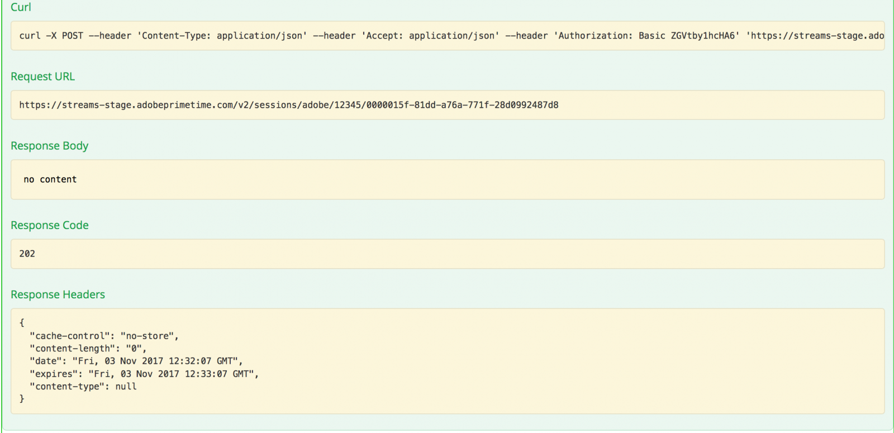

# API-overzicht {#api-overview}

De weergave [online API-documentatie](http://docs.adobeptime.io/cm-api-v2/) voor meer informatie .

## Doel en voorwaarden {#purpose-prerequisites}

Dit document helpt toepassingsontwikkelaars om onze Swagger API-specificatie te gebruiken bij het implementeren van een integratie met Gelijktijdige bewaking. Het wordt ten zeerste aanbevolen dat de lezer een eerder inzicht heeft in de concepten die door de service zijn gedefinieerd voordat deze richtlijn wordt gevolgd. Om dit inzicht te krijgen, moet er een overzicht zijn van de [productdocumentatie](/help/concurrency-monitoring/cm-home.md) en de [Specificatie van de API voor opkrullen](http://docs.adobeptime.io/cm-api-v2/).

## Inleiding {#api-overview-intro}

Tijdens het ontwikkelingsproces vormt de openbare documentatie van Swagger de referentierichtlijn voor het begrijpen en testen van de API-stromen. Dit is een grote plaats om te beginnen om een hands-on benadering te hebben en vertrouwd te worden met de manier de echte toepassingen zich in verschillende scenario&#39;s van gebruikersinteractie zouden gedragen.

Een ticket verzenden naar [Zendesk](mailto:tve-support@adobe.com) om uw bedrijf en toepassingen te registreren in Gelijktijdige Controle. Adobe wijst een toepassings-id toe aan elke entiteit. In deze handleiding gebruiken we twee referentietoepassingen met id **demo-app** en **demo-app-2** die onder de huurder Adobe zullen vallen.

## Gebruik hoofdletters {#api-use-case}

De eerste stap bij het testen van een flow met Swagger is het invoeren van de toepassings-id in de rechterbovenhoek van de pagina, als volgt:

Hierna drukken we op **Verkennen** om identiteitskaart te plaatsen die in de kopbal van de Vergunning voor alle vraag zal worden gebruikt die aan REST API wordt gemaakt.  Elke API-aanroep verwacht dat de toepassings-id wordt doorgegeven via HTTP-basisverificatie. De gebruikersnaam is de toepassings-id en het wachtwoord is leeg.

### Eerste toepassing {#first-app-use-cases}

Toepassing met id **demo-app** is toegewezen door het team van Adobe een beleid met één regel die het aantal gezamenlijke stromen tot 3 beperkt. Een beleid wordt toegewezen aan een specifieke toepassing op basis van het in Zendesk ingediende verzoek.

#### Metagegevens ophalen {#retrieve-metadata-use-case}

De eerste aanroep die we uitvoeren, is bestemd voor de bron Metagegevens om de lijst met metagegevenskenmerken te verkrijgen die als formuliergegevens moeten worden doorgegeven tijdens de sessieinitialisatie. Deze metagegevens worden gebruikt om het beleid te evalueren dat is toegewezen aan deze toepassing.

Nadat u op &quot;Try it out&quot; hebt gedrukt, voor de toepassing met id **demo-app** wij zullen het volgende resultaat bereiken :

Zoals u kunt zien in het veld voor de responsstructuur, is de lijst met metagegevenskenmerken leeg. Dit betekent dat de kenmerken die door het ontwerp worden vereist, voldoende zijn om het beleid voor drie streams te evalueren dat aan deze toepassing is toegewezen. Zie ook: [Documentatie over standaardmetagegevensvelden](/help/concurrency-monitoring/standard-metadata-attributes.md). Na deze vraag, kunnen wij verdergaan en een nieuwe zitting op het middel van de REST van Sessies tot stand brengen.

#### Sessieinitialisatie {#session-initial}

De vraag van de zittingsinitialisatie wordt gedaan door een toepassing na het verwerven van alle noodzakelijke informatie nodig om het uit te voeren.

Er is geen behoefte om enige beëindigingscode op de eerste vraag te verstrekken omdat wij geen andere actieve stromen hebben. En geen metagegevenskenmerk omdat geen van de aanroepen van metagegevens is geretourneerd.

De **onderwerp** en de **idp** parameters zijn verplicht, worden ze opgegeven als URI-padvariabelen. U kunt de **onderwerp** en **idp** parameters door een oproep te doen voor de **mvpd** en **upstreamUserID** metagegevensvelden van Adobe Primetime-verificatie. Zie ook: [overzicht van metagegevens-API&#39;s](https://experienceleague.adobe.com/docs/primetime/authentication/auth-features/user-metadat/user-metadata-feature.html?lang=en#). In dit voorbeeld geven we de waarde &quot;12345&quot; als het onderwerp en &quot;adobe&quot; als het idp.

Stel de initialisatieaanroep voor de sessie in. U krijgt het volgende antwoord:

Alle gegevens die we nodig hebben, staan in de antwoordheaders. De **Locatie** header staat voor de id van de nieuwe gemaakte sessie en de **Datum** en **Verloopt** Kopteksten vertegenwoordigen de waarden die worden gebruikt om uw toepassing te plannen om de volgende hartslag te maken om de zitting levend te houden.

#### Hartslag {#heartbeat}

Maak een hartslagvraag. Geef de **sessie-id** verkregen in de vraag van de zittingsinitialisatie, samen met **onderwerp** en **idp** gebruikte parameters.

Als de sessie nog geldig is (deze is niet verlopen of handmatig verwijderd), krijgt u een geslaagd resultaat:

Net als in het eerste geval zullen wij de **Datum** en **Verloopt** kopteksten om een andere hartslag voor deze bepaalde zitting te plannen. Als de zitting niet meer geldig is, zal deze vraag met een 410 GONE code van de Status van HTTP ontbreken.

U kunt de optie &quot;De stream in leven houden&quot; gebruiken in de gebruikersinterface van Swagger om automatische hartslagen op een bepaalde sessie uit te voeren. Dit kan u helpen een regel te testen zonder u zorgen te hoeven maken over de boilerplate die nodig is om geschikte sessiehartslagen te doen. Deze knop wordt naast de knop &quot;Uitproberen&quot; op het tabblad Swagger-hartslag geplaatst. Als u een automatische hartslag wilt instellen voor alle gemaakte sessies, moet u deze elk in een aparte Swagger-interface hebben gepland die wordt geopend op een tabblad van een webbrowser.

#### Sessiebeëindiging {#session-termination}

De bedrijfscase van uw bedrijf zou Gelijktijdige Controle kunnen vereisen om een specifieke zitting te beëindigen wanneer, bijvoorbeeld, een gebruiker ophoudt bekijkend een video. Dit kan worden gedaan door een vraag van de DELETE op het middel van Zittingen te maken.

Gebruik de zelfde parameters voor de vraag zoals voor de zittingshartslag. De HTTP-statuscodes voor reacties zijn:

* 202 AANVAARD voor een succesvol antwoord
* 410 GONE als de sessie al was gestopt.

#### Het beleid doorbreken {#breaking-policy-app-first}

Om het gedrag van onze toepassing te simuleren wanneer het 3 die stroombeleid aan het wordt toegewezen wordt gebroken moeten wij 3 vraag tot zittingsinitialisering maken. Om het beleid van kracht te worden, moeten de vraag worden gedaan alvorens één van de zitting wegens gebrek aan hartslagen verloopt. We zullen zien dat deze oproepen allemaal succes hebben, maar als we een vierde aanroepen, dan zal dat mislukken met de volgende fout:

Wij krijgen een reactie 409 CONFLICT samen met een voorwerp van het evaluatieresultaat in de lading. Lees een volledige beschrijving van het evaluatieresultaat in de [Specificatie van de API voor opkrullen](http://docs.adobeptime.io/cm-api-v2/#evaluation-result).

De toepassing kan de informatie van het evaluatieresultaat gebruiken om een bepaald bericht aan de gebruiker te tonen wanneer het tegenhouden van de video en verdere acties te nemen indien nodig. U kunt andere bestaande streams stoppen om een nieuwe te starten. Dit wordt gedaan door te gebruiken **terminateCode** waarde aanwezig in de **conflicten** veld voor een specifiek conflicterend kenmerk. De waarde zal als X-beëindig HTTP- kopbal in de vraag naar een nieuwe zittingsinitialisering worden verstrekt.

Wanneer het verstrekken van één of meerdere beëindigingscodes bij zitingsinitialisatie zal de vraag slagen en een nieuwe zitting zal worden geproduceerd. Dan als wij proberen om een hartslag met één van de zittingen te maken die ver zijn tegengehouden zullen wij een reactie van 410 GONE met een nuttige last van het evaluatieresultaat terugkrijgen die het feit beschrijft dat de zitting ver, zoals in het voorbeeld is geëindigd:

### Tweede toepassing {#second-application}

De andere voorbeeldtoepassing die we gaan gebruiken, is de toepassing met id **demo-app-2**. Aan deze regel is een beleid toegewezen met één regel die het aantal stromen dat beschikbaar is voor een kanaal beperkt tot maximaal 2.   U moet de kanaalvariabele verstrekken om dit beleid te evalueren.

#### Metagegevens ophalen {#retrieving-metadata}

Stel de nieuwe toepassings-id in de rechterbovenhoek van de pagina in en roep de bron Metagegevens aan. U krijgt het volgende antwoord:

Deze keer is de hoofdtekst van de reactie niet langer een lege lijst, zoals in het voorbeeld van de eerste toepassing. Nu verklaart de dienst voor toezicht op de valutamarkt in het responsorgaan dat de **kanaal** de meta-gegevens worden vereist tijdens zittingsinitialisering om het beleid te evalueren.

Als u een vraag maakt zonder een waarde voor **kanaal** parameter, krijgt u:

* Antwoordcode - 400 SLECHTS VERZOEK
* De Lichaam van de reactie - een nuttige last van het evaluatieresultaat die in **verplichtingen** veld wat wordt verwacht in de aanvraag voor sessieinitialisatie om de bewerking te laten slagen.

#### Sessieinitialisatie {#session-init}

Wijs een waarde toe voor de vereiste meta-gegevenssleutel en plaats het als vormparameter in het verzoek van de zittingsinitialisering, zoals hieronder getoond:

Nu zal de vraag slagen en een nieuwe zitting zal worden geproduceerd.

#### Het beleid doorbreken {#breaking-policy-second-app}

Om de regel te breken die wij in het beleid hebben dat aan deze toepassing wordt toegewezen, moeten wij 2 vraag met de zelfde kanaalwaarde maken. Zoals in het eerste voorbeeld, moet de tweede vraag worden gedaan terwijl de eerste geproduceerde zitting nog geldig is.

Als wij verschillende waarden voor de kanaalmeta-gegevens gebruiken telkens als wij een nieuwe zitting creëren zullen alle vraag slagen omdat de drempel van 2 aan elke waarde individueel wordt behandeld.

Zoals in het eerste voorbeeld, kunnen wij de beëindigingscode gebruiken om het tegenstrijdige stromen ver tegen te houden of kunnen wij op één van de stromen wachten te verlopen, veronderstellend dat geen hartslag op hen zal worden in werking gesteld.

