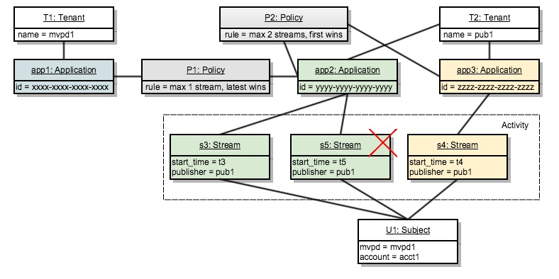

# Beleidsbeslissingspunt {#policy-desc-pt}

## Domeinmodel {#domain-model}

Deze pagina moet dienen als referentie voor verschillende toepassingen en implementaties van beleid. We raden u aan ook de [Verklarende woordenlijst](/help/concurrency-monitoring/cm-glossary.md) deel van de documentatie voor definities van termen.

A **huurder** bezit **toepassingen** waarvoor zij de naleving van **beleid**. **Clienttoepassingen** moet worden gevormd met **toepassings-id** (verstrekt door Adobe).

De huurder associeert dan elke toepassing met één of meerdere beleid, of gecreeerd door hem of gecreeerd en gedeeld door anderen. Het beleid kan tussen veelvoudige huurders worden verbonden.

De **onderwerpactiviteit** bestaat uit alle stromen (ongeacht de toepassing) die voor een bepaald onderwerp aan de Gelijktijdige Controle worden gemeld.

Wanneer een stream voor een bepaald onderwerp moet worden geautoriseerd, controleert het systeem eerst alle beleidsregels die zijn gedefinieerd voor de toepassing die de stream heeft gemaakt.

Voor elk beleid dat van toepassing is, moeten we dan alle **relevante activiteit** dat zal aan de regel worden doorgegeven . De **relevante activiteit** voor beleid P zal slechts een stroom S omvatten als het aan de volgende voorwaarde voldoet:

**De stroom &quot;S&quot;wordt begonnen door een toepassing die beleid &quot;P&quot;onder zijn beleid omvat.**

## Droog gebruik {#dry-run-use-cases}

De analyse hieronder is bedoeld om het model tegen sommige gebruiksgevallen te bevestigen. We doen dat geleidelijk, door te beginnen met een basisconfiguratie en complexiteit op verschillende manieren toe te voegen.

### 1. Eén huurder. Eén toepassing. Eén beleid. Eén stream {#onetenant-oneapp-onepolicy-onestream}

Wij zullen met één enkele huurder, met één enkele toepassing en één enkel verbonden beleid beginnen. Laten we aannemen dat het beleid stelt dat er maximaal één actieve stream voor elke gebruiker kan zijn (de laatste stream mag worden afgespeeld).

Wanneer een stream is gestart, bestaat de activiteit alleen uit die stream en kan deze worden afgespeeld.

### 2. Eén huurder. Eén toepassing. Eén beleid. Twee stromen. {#onetenant-oneapp-onepolicy-twostreams}

Wanneer een tweede stream is gestart (door hetzelfde onderwerp dat dezelfde toepassing gebruikt), bestaat de voor validatie gebruikte activiteit uit beide **s1** en **s2**.

De limiet wordt overschreden omdat het beleid bepaalt dat slechts één stream mag worden afgespeeld, dus we staan alleen de laatste stream toe (**s2**) om te spelen.

>[!NOTE]
>
>De diagrammen vertegenwoordigen de systeemmening op de gebruikersactiviteit. Voor streaminitialisatiepogingen wordt het toegangsbesluit opgenomen in de reactie. Voor actieve stromen zal het besluit op de hartslagreactie worden teruggekeerd.

### 3. Twee huurders. Twee toepassingen. Eén beleid. Twee stromen. {#twotenant-twoapp-onepolicy-twostreams}

Laten wij nu veronderstellen dat een nieuwe huurder het zelfde beleid in hun toepassingen wil afdwingen:

Aangezien de twee huurders met hetzelfde beleid verbonden zijn, is de in overweging 2 beschreven situatie hier van toepassing en **s3** kan worden afgespeeld aangezien dit de laatste stream is.

### 4. Twee huurders. Drie toepassingen. Twee beleidsvormen. Twee stromen. {#twotenants-threeapps-twopolicies-twostreams}

Nu, veronderstellen dat de tweede huurder een nieuwe toepassing opstelt en een nieuw beleid wil bepalen dat tussen zal worden gedeeld **app2** en **app3**.

Op dit moment worden de actieve streams **s3** en **s4** beide zijn toegestaan. Voor **s3**, wanneer het beleid **P1** wordt beoordeeld, telt het systeem alleen mee **s3** als **relevante activiteit** (**s4** op geen enkele wijze verband houdt met het beleid **P1**) dus er is geen sprake van een overtreding.

Beleid **P2** wordt toegepast op beide stromen en omvat beide **s3** en **s4** als relevante activiteit. Aangezien deze activiteit binnen de grenzen van twee stromen is, worden beide stromen toegestaan.

### 5. Twee huurders. Drie toepassingen. Twee beleidsvormen. Drie stromen. {#twotenants-threeapps-twopolicies-threestreams}

Nu wordt aangenomen dat een nieuwe poging tot stroominitialisatie wordt uitgevoerd met **app2**:

**s5** mag beginnen met **P1** (waardoor nieuwere stromen kunnen worden overgenomen) maar dit wordt geweigerd door **P2**, dus het zal niet beginnen.

Hetzelfde gebeurt als een stroominit wordt geprobeerd met app3: hetzelfde beleid P2 weigert de toegang.

Nu, zien wat zou gebeuren als de gebruiker probeert om een nieuwe stroom tot stand te brengen gebruikend app1:

De toepassing app1 is geenszins gerelateerd aan het beleid **P2**, zodat zij alleen het beleid zal toepassen **P1**: waardoor de nieuwe stream kan worden gestart en de oudere wordt ontkend (**s3** in dit geval).

