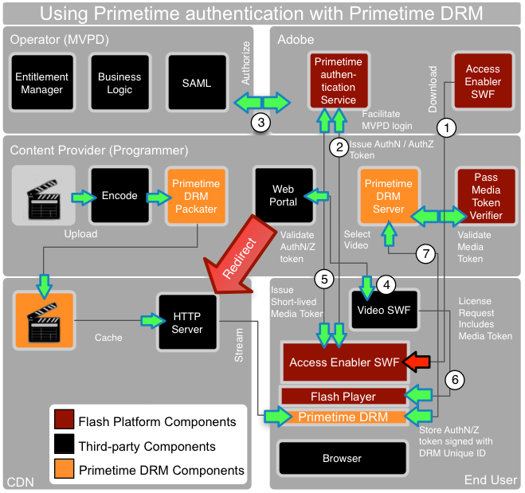

# Adobe Primetime-verificatie en Adobe Primetime DRM {#adobe-primetime-authentication-and-adobe-primetime-drm}

Adobe Primetime-verificatie ( [https://www.adobe.com/products/adobepass/](https://www.adobe.com/products/adobepass/)) biedt gebruikers-/apparaatverificatie en autorisatie voor meerdere inhoudsproviders. De gebruiker moet een geldig kabeltelevisie of satellietabonnement hebben.

<!---->

Adobe Primetime-verificatie kan samen met Adobe Primetime DRM worden gebruikt om de media-inhoud te beschermen. In dit scenario kan de videospeler (SWF) een ander SWF-bestand met de naam *Access Enabler* laden, dat wordt gehost door Adobe Systems. *Access Enabler* wordt gebruikt om verbinding te maken met de Adobe Primetime-verificatieservice en om SAML SSO-integratie met MVPD&#39;s (Multichannel Video Programming Distributor)-identiteitsproviders te vergemakkelijken. Dit betekent dat de browser van de gebruiker kort naar de MVPD-aanmeldingspagina wordt omgeleid, dat een AuthN-token wordt voortgezet en dat ten slotte met een in de cache opgeslagen AuthN-sessie wordt teruggegaan naar de website van de inhoud.

Met *Access Enabler* kunt u back-end autorisaties tussen de Adobe Primetime-verificatieservice en de MVPD vereenvoudigen. MVPD handhaaft de bedrijfslogica en bepaalt welke inhoud de gebruiker aan heeft. De bevoegdheid wordt voortgeduurd in een extra token AuthZ voor die inhoudsbron en wordt teruggestuurd naar de client.

De verificatie- en autorisatietokens worden ondertekend met de unieke id en de persoonlijke sleutel van de Primetime DRM-client om te voorkomen dat er wordt geknoeid met of geknoeid met de computer. Dit token is alleen toegankelijk via *Access Enabler*.

De videospeler kan het proces teweegbrengen door `getAuthorization` op *Toegangsmanager* te roepen. Wanneer geldige AuthN/AuthZ tokens aanwezig zijn, *AccessEnabler* geeft een callback aan de videospeler uit die een kort-levend media teken voor het spelen van de videoinhoud zal omvatten.

Adobe Primetime-verificatie biedt een Java-bibliotheek voor mediatoken-validatie die kan worden geïmplementeerd op een server. Wanneer u de Primetime DRM-server gebruikt voor inhoudsbeveiliging, kunt u de mediatoken-validator integreren met een Primetime DRM-plug-in voor servers om automatisch een algemene licentie uit te geven nadat u de mediatoken hebt gevalideerd. De inhoud wordt dan gestreamd van de CDN-servers naar de client. Als u een inhoudslicentie wilt aanschaffen, kan het kortstondige media-token worden verzonden naar de Primetime DRM-server, waar de geldigheid van het token wordt geverifieerd en een licentie kan worden uitgegeven.

Het token AuthN met een lange levensduur wordt over het algemeen gebruikt door *Access Enabler* voor alle inhoudsontwikkelaars om AuthN voor die MVPD-abonnee te vertegenwoordigen. Bovendien kunnen de Server Primetime DRM en de Symbolische Verifier door CDN of een dienstverlener namens de inhoudsleverancier worden in werking gesteld.