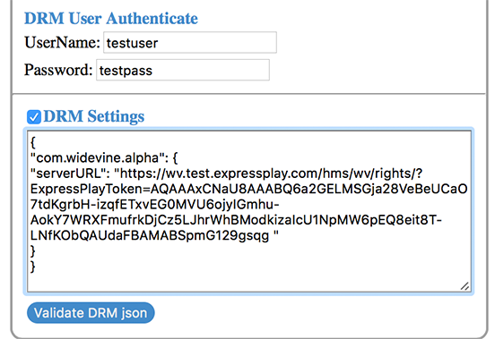

# Beschermde inhoud afspelen {#playback-your-protected-content}

Als u de DRM-oplossing wilt testen, hebt u een videotoepassing nodig die de specifieke DRM-oplossing kan verwerken waarmee u werkt. Deze speler kan een voorbeeldspeler zijn die door Adobe of uw eigen op TVSDK gebaseerde videotoepassing beschikbaar wordt gesteld.

1. Gebruik de URL van de licentieserver van het tokenantwoord dat u hebt gekregen van de ExpressPlay-server om te testen of u de beveiligde inhoud kunt afspelen.

   * **Widevine** - Gebruik de Widevine-reactie rechtstreeks zoals u van uw ExpressPlay-licentietoken-verzoek hebt ontvangen.
   * **PlayReady** - Haal de URL en het token van de licentieserver op van het JSON-object dat door uw aanvraag voor het licentietoken is geretourneerd.
   * **FairPlay** - Gebruik het FairPlay-antwoord rechtstreeks zoals u hebt ontvangen van uw ExpressPlay-licentietoken-verzoek.

1. Test het afspelen van uw beveiligde inhoud met behulp van uw eigen speler of een bestaande Adobe voorbeeldspeler.

   Geef de URL voor de beveiligde inhoud op (de locatie van het M3U8- of MPD-manifest, afhankelijk van de DRM-oplossing die u test).

   Afhankelijk van de interface die wordt geleverd door de speler waarmee u test, kan u worden gevraagd om de licentie-URL en het token afzonderlijk te leveren als tekenreeksen in invoervelden, of als een JSON-object dat in een tekstvak wordt geplakt, of misschien als een queryparameter in de URL.

   Hier worden enkele mogelijkheden voor testspelers vermeld:

   * HTML5 Reference Player:

     ```
     https://ptdemos.com/html5/internal/1_2/2.4_GM/samples/reference/reference_player.html
     ```

   * Shaka Player:

     ```
     https://shaka-player-demo.appspot.com
     ```

   * Voorbeeld van TVSDK Player (in ontwikkeling) -

   ```
   https://drmtest2.adobe.com/TVSDK_HTML5/samples/reference/reference_player.html
   ```

   **Het afspelen controleren tijdens het testen van uw FairPlay-instellingen:** FairPlay vereist enkele extra stappen om inhoud af te spelen wanneer u de ExpressPlay-licentieservers gebruikt. Als u [!DNL curl] om uw verbindingen te testen (zoals beschreven in [Licentie](../../multi-drm-workflows/quick-start/handle-the-licensing.md)), moet u *uw M3U8-manifest bewerken* (uw verpakte inhoud) als volgt:

1. Voeg de reactie die u van uw verzoek van het licentietoken hebt teruggekregen toe aan de `#EXT-X-KEY:` in het manifest, en
1. Wijzig het protocol van die URL vanuit de reactie (nu in het manifest), van `https://` tot `skd://`.

   Hier volgt een volledig voorbeeld voor het testen van het afspelen met FairPlay, inclusief de licentiesstap:

1. Gebruik de FairPlay-licentietoken-aanvraag om uw licentie-token-URL te verkrijgen. (Gebruik uw eigen Verificator van de Klant van de Productie, en ben zeker om het zelfde CEK te gebruiken en `iv` die is gebruikt om uw FairPlay-inhoud te verpakken.) Voer de volgende opdracht uit om de licentietoken-URL voor de voorbeeldinhoud te verkrijgen:

   ```
   curl -v "https://fp-gen.service.expressplay.com/hms/fp/token? 
   customerAuthenticator=[YOUR-PRODUCTION-AUTHENTICATOR]&errorFormat=json 
   &contentKey CEK as query parameter contentKey 
   =[YOUR CONTENT KEY]&iv=[YOUR IV]"
   ```

   U krijgt een reactie met de licentietoken-URL die er ongeveer als volgt uitziet:

   ```
   https://fp.service.expressplay.com:80/hms/fp/rights/? 
   ExpressPlayToken=AQAAABNlKcEAAABQaTjshua3cWjG_Il3fvhf3g-CR1rn 
   JKdtaVaAnhkfTCW0bWAU76YgwForbrXhD5tXUHhfP7FD1svvLPxN5qomYsnwY 
   SSwcDq1ZnRtXunFLueTw6LAL52aZllMLasCSzYRMaAVHw 
   ```

1. Plaats de geretourneerde URL-reactie van het licentietoken in uw M3U8-manifest, en *Wijzig het schema van licentietoken-URL in* `sdk://` van `https://`. Hieronder ziet u een voorbeeld van de tag #EXT-X-KEY in uw manifest van M3U8:

   ```
   #EXT-X-KEY:METHOD=SAMPLE-AES, 
   URI="skd://fp.service.expressplay.com:80/hms/fp/rights/? 
   ExpressPlayToken=AQAAABNlKcEAAABQaTjshua3cWjG_Il3fvhf3g- 
   CR1rnJKdtaVaAnhkfTCW0bWAU76YgwForbrXhD5tXUHhfP7FD1svvLPx 
   N5qomYsnwYSSwcDq1ZnRtXunFLueTw6LAL52aZllMLasCSzYRMaAVHw", 
   KEYFORMAT="com.apple.streamingkeydelivery",KEYFORMATVERSIONS="1"
   ```

   >[!NOTE]
   >
   >De bovenstaande informatie is alleen van toepassing op het testen van uw FairPlay-instelling. Het is mogelijk niet van toepassing op uw productie-instellingen, afhankelijk van de manier waarop u uw FairPlay-handler configureert. Zie [Apple FairPlay inschakelen in iOS-toepassingen](../../../programming/tvsdk-3x-ios-prog/ios-3x-drm-content-security/ios-3x-apple-fairplay-tvsdk.md) voor meer informatie.

Als uw video wordt afgespeeld, hebt u uw inhoud in een pakket opgenomen en een licentie gegeven. Als uw video niet wordt afgespeeld, controleer de het oplossen van problemenpagina voor sommige mogelijke oplossingen aan uw problemen.

<!--<a id="example_603D92A1F3924467B5D66EC862B8F59C"></a>-->

Hier ziet u bijvoorbeeld het gedeelte van de gebruikersinterface in de eerste testspeler die hierboven wordt vermeld, waarin u de licentiegegevens opgeeft die zijn verkregen van de ExpressPlay-server:

<!--<a id="fig_zjy_q2c_rw"></a>-->


