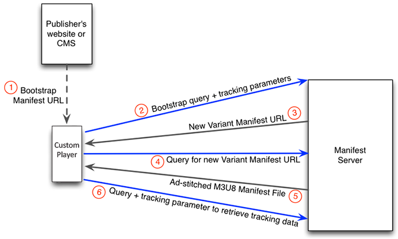

# Overzicht van niet-TVSDK client-side tracking {#overview-of-non-tvsdk-client-side-tracking}

Uitgevers kunnen HLS-Volgzame videospelers bouwen die met de cliënt-kant en volgwerkschema&#39;s van de server van Primetime manifest werken. De interfaces aan de manifestserver voor de levende stroom en video op bestelling (VOD) gevallen zijn lichtjes verschillend.

De manifestserver verstrekt API om douanespelers toe te laten om de volgende URLs te verzoeken, die zij kunnen gebruiken om gebeurtenissen te melden en te volgen:

* Advertentie
* Ad kwartiel
* Voortgang van advertentiepod
* Voortgang inhoudspod

De API van de manifestserver veronderstelt dat om het even welke videospeler die het gebruikt aan de minimumvereisten voldoet. Zie [Vereisten voor videospeler](/help/primetime-ad-insertion/~old-msapi-topics/ms-player-req.md) voor meer informatie.

## Workflow {#section_cst_flow} voor tracering aan de clientzijde



1. De speler verkrijgt een manifestserver URL van de uitgever.
1. De speler voegt vraagparameters toe specifiek aan zijn vereisten van de advertentie toevoegt en verzendt een verzoek van de GET van HTTP naar de resulterende Bootstrap URL. De Bootstrap URL heeft de volgende syntaxis:

   ```URL
   http{s}://{manifest-server:port}/auditude/variant/{PublisherAssetID}/{urlSafeBase64({Content URL})}.m3u8?{query parameters}
   ```

   Bijvoorbeeld:

   ```URL
   https://manifest.auditude.com/auditude/variant/
   7LTc86_kMUDFcCjoH9X7K_2auwb_gnWM/aHR0cDovL3B0ZGVtb3MuY29tL3ZpZGVvcy90b3NoZHVuZW5jcnlwdGVkL2hscy90ZXN0Mi5tM3U4.m3u8?
   u=9a2893fd893cab27da24059ff034b78d&z=173475&pttrackingmode=simple&pttrackingversion=v2&__sid__=docExample02
   ```

   De URL bevat de elementen die worden beschreven in [Een opdracht verzenden naar de manifest-server](/help/primetime-ad-insertion/~old-msapi-topics/ms-getting-started/ms-sending-cmd.md).

1. De manifestserver vestigt een zitting voor die speler en produceert een unieke zitting-identiteitskaart Er wordt een nieuwe URL voor de M3U8-afspeellijst gemaakt, die als JSON-reactie wordt geretourneerd naar de speler. De JSON heeft de volgende syntaxis:

   ```JSON
   {
    "Master-M3U8": "https://{manifest-server:port}/auditude/variant/{PublisherAssetID}/{SessionID}/
       {urlSafeBase64(content URL)}.m3u8?u={Asset ID}&z={Zone ID}&pttrackingmode=simple&pttrackingversion=v2
       &{Any other query parameters}"
   }
   ```

   Bijvoorbeeld:

   ```JSON
   https://pcor3.manifest.auditude.com/auditude/variant/7LTc86_kMUDFcCjoH9X7K_2auwb_gnWM/f958bef8-9158-43cc-80b9-4b15417b7895/aHR0cDovL3B0ZGVtb3MuY29tL3ZpZGVvcy90b3NoZHVuZW5jcnlwdGVkL2hscy90ZXN0Mi5tM3U4.3u8?u=9a2893fd893cab27da24059ff034b78d&z=173475&pttrackingmode=simple&pttrackingversion=v2
   ```

1. De speler gebruikt URL van de reactie JSON om de nieuwe master afspeellijst van de variant M3U8 van de manifestserver te verzoeken.

1. De manifestserver keert een nieuwe variant M3U8 terug die stroom-vlakke playlist URLs met een syntaxis gelijkend op het volgende bevat:

   ```URL
   http{s}://{manifest-server:port}/auditude/{live|vod}/{PublisherAssetID}/
     {rendition}/{groupID}/{urlSafeBase64(bit rate stream URL)}.m3u8?u={Ad Request Id}&z={Ad Zone Id}&{Any other query parameters}
   ```

   Bijvoorbeeld:

   ```URL
   #EXTM3U
   #EXT-X-VERSION:5
   #EXT-X-MEDIA:TYPE=SUBTITLES,GROUP-ID="subs",NAME="English",AUTOSELECT=YES,DEFAULT=YES,FORCED=NO,LANGUAGE="eng",URI="https://pcor3.manifest.auditude.com/auditude/vod/7LTc86_kMUDFcCjoH9X7K_2auwb_gnWM/webvtt/f958bef8-9158-43cc-80b9-4b15417b7895/aHR0cDovL3d3dy5wdGRlbW9zLmNvbS92aWRlb3MvdG9zaGR1bmVuY3J5cHRlZC9obHMvd2VidnR0L1RPUy1lbjIubTN1OA.m3u8?u=9a2893fd893cab27da24059ff034b78d&z=173475&pttrackingmode=simple&pttrackingversion=v2"
   #EXT-X-STREAM-INF:BANDWIDTH=10000000,SUBTITLES="subs"
   https://pcor3.manifest.auditude.com/auditude/vod/7LTc86_kMUDFcCjoH9X7K_2auwb_gnWM/10000/f958bef8-9158-43cc-80b9-4b15417b7895/aHR0cDovL3d3dy5wdGRlbW9zLmNvbS92aWRlb3MvdG9zaGR1bmVuY3J5cHRlZC9obHMvMTAwMDAvdG9jXzEwMDAwLm0zdTg.m3u8?u=9a2893fd893cab27da24059ff034b78d&z=173475&pttrackingmode=simple&pttrackingversion=v2
   #EXT-X-STREAM-INF:BANDWIDTH=1300000,SUBTITLES="subs"
   https://pcor3.manifest.auditude.com/auditude/vod/7LTc86_kMUDFcCjoH9X7K_2auwb_gnWM/1300/f958bef8-9158-43cc-80b9-4b15417b7895/aHR0cDovL3d3dy5wdGRlbW9zLmNvbS92aWRlb3MvdG9zaGR1bmVuY3J5cHRlZC9obHMvMTMwMC90b2NfMTMwMC5tM3U4.m3u8?u=9a2893fd893cab27da24059ff034b78d&z=173475&pttrackingmode=simple&pttrackingversion=v2
   #EXT-X-STREAM-INF:BANDWIDTH=3400000,SUBTITLES="subs"
   https://pcor3.manifest.auditude.com/auditude/vod/7LTc86_kMUDFcCjoH9X7K_2auwb_gnWM/3400/f958bef8-9158-43cc-80b9-4b15417b7895/aHR0cDovL3d3dy5wdGRlbW9zLmNvbS92aWRlb3MvdG9zaGR1bmVuY3J5cHRlZC9obHMvMzQwMC90b2NfMzQwMC5tM3U4.m3u8?u=9a2893fd893cab27da24059ff034b78d&z=173475&pttrackingmode=simple&pttrackingversion=v2
   #EXT-X-STREAM-INF:BANDWIDTH=2100000,SUBTITLES="subs"
   https://pcor3.manifest.auditude.com/auditude/vod/7LTc86_kMUDFcCjoH9X7K_2auwb_gnWM/2100/f958bef8-9158-43cc-80b9-4b15417b7895/aHR0cDovL3d3dy5wdGRlbW9zLmNvbS92aWRlb3MvdG9zaGR1bmVuY3J5cHRlZC9obHMvMjEwMC90b2NfMjEwMC5tM3U4.m3u8?u=9a2893fd893cab27da24059ff034b78d&z=173475&pttrackingmode=simple&pttrackingversion=v2
   #EXT-X-STREAM-INF:BANDWIDTH=800000,SUBTITLES="subs"
   https://pcor3.manifest.auditude.com/auditude/vod/7LTc86_kMUDFcCjoH9X7K_2auwb_gnWM/800/f958bef8-9158-43cc-80b9-4b15417b7895/aHR0cDovL3d3dy5wdGRlbW9zLmNvbS92aWRlb3MvdG9zaGR1bmVuY3J5cHRlZC9obHMvODAwL3RvY184MDAubTN1OA.m3u8?u=9a2893fd893cab27da24059ff034b78d&z=173475&pttrackingmode=simple&pttrackingversion=v2
   #EXT-X-STREAM-INF:BANDWIDTH=5000000,SUBTITLES="subs"
   https://pcor3.manifest.auditude.com/auditude/vod/7LTc86_kMUDFcCjoH9X7K_2auwb_gnWM/5000/f958bef8-9158-43cc-80b9-4b15417b7895/aHR0cDovL3d3dy5wdGRlbW9zLmNvbS92aWRlb3MvdG9zaGR1bmVuY3J5cHRlZC9obHMvNTAwMC90b2NfNTAwMC5tM3U4.m3u8?u=9a2893fd893cab27da24059ff034b78d&z=173475&pttrackingmode=simple&pttrackingversion=v2
   #EXT-X-STREAM-INF:BANDWIDTH=7500000,SUBTITLES="subs"
   https://pcor3.manifest.auditude.com/auditude/vod/7LTc86_kMUDFcCjoH9X7K_2auwb_gnWM/7500/f958bef8-9158-43cc-80b9-4b15417b7895/aHR0cDovL3d3dy5wdGRlbW9zLmNvbS92aWRlb3MvdG9zaGR1bmVuY3J5cHRlZC9obHMvNzUwMC90b2NfNzUwMC5tM3U4.m3u8?u=9a2893fd893cab27da24059ff034b78d&z=173475&pttrackingmode=simple&pttrackingversion=v2
   #EXT-X-STREAM-INF:BANDWIDTH=500000,SUBTITLES="subs"
   https://pcor3.manifest.auditude.com/auditude/vod/7LTc86_kMUDFcCjoH9X7K_2auwb_gnWM/500/f958bef8-9158-43cc-80b9-4b15417b7895/aHR0cDovL3d3dy5wdGRlbW9zLmNvbS92aWRlb3MvdG9zaGR1bmVuY3J5cHRlZC9obHMvNTAwL3RvY181MDAubTN1OA.m3u8?u=9a2893fd893cab27da24059ff034b78d&z=173475&pttrackingmode=simple&pttrackingversion=v2
   ```

1. De speler selecteert de juiste enkelvoudige bitsnelheid en de URL voor het streaming manifest voor het afspelen van de inhoud met advertenties. Bijvoorbeeld:

   ```URL
   https://pcor3.manifest.auditude.com/auditude/vod/7LTc86_kMUDFcCjoH9X7K_2auwb_gnWM/500/f958bef8-9158-43cc-80b9-4b15417b7895/aHR0cDovL3d3dy5wdGRlbW9zLmNvbS92aWRlb3MvdG9zaGR1bmVuY3J5cHRlZC9obHMvNTAwL3RvY181MDAubTN1OA.m3u8?u=9a2893fd893cab27da24059ff034b78d&z=173475&pttrackingmode=simple&pttrackingversion=v2
   ```

1. De manifestserver keert een stroom-vlakke manifest terug die verbindingen aan de inhoud en de verbindingen van het segment van de advertentie TS bevat. Bijvoorbeeld:

   ```
      #EXTM3U
   #EXT-X-VERSION:3
   #EXT-X-TARGETDURATION:8
   #EXT-X-PLAYLIST-TYPE:VOD
   
   #EXT-X-DISCONTINUITY
   #EXTINF:8,
   https://primetime-a.akamaihd.net/assets/repackage/production/zen/195/10516675/2ac89785ee8df17a31b2594c61f6921e-300k-00001.ts
   #EXTINF:7,
   https://primetime-a.akamaihd.net/assets/repackage/production/zen/195/10516675/2ac89785ee8df17a31b2594c61f6921e-300k-00002.ts
   
   #EXT-X-DISCONTINUITY
   #EXTINF:4,
   https://www.ptdemos.com/videos/toshdunencrypted/hls/500/toc_500.0.ts
   #EXTINF:4,
   https://www.ptdemos.com/videos/toshdunencrypted/hls/500/toc_500.4000.ts
   #EXTINF:4.833,
   https://www.ptdemos.com/videos/toshdunencrypted/hls/500/toc_500.8000.ts   
   ```

   >[!NOTE]
   >
   >De speler selecteert de URL van de afspeellijst op streamniveau om de inhoudsstroom te verkrijgen. De manifestserver wint originele playlist van CDN terug. Sommige codeermodules kunnen extra details in het `#EXTINF` titelattribuut injecteren, bijvoorbeeld:
   >
   >
   ```
   >#EXTINF:6.006,LTC=2017-08-23T13:25:47+00:00
   >```

   Aangezien de manifestserver niet de betekenis van niet-standaardattributen kan afleiden om hen voor ad-stitched playlist te wijzigen, verwijdert de manifestserver alle extra attributen voorbij de duurinformatie in deze markering. Zie de [EXTINF](https://tools.ietf.org/html/rfc8216#section-4.3.2.1)-vermelding in de HLS-specificatie voor meer informatie.

1. Om het volgen informatie te verzoeken, voegt de speler de vraagparameter `pttrackingposition` met om het even welke alfanumerieke waarde aan stream-vlakke playlist URL voor het geselecteerde beetjetarief toe. Bijvoorbeeld:

   ```URL
   https://pcor3.manifest.auditude.com/auditude/vod/7LTc86_kMUDFcCjoH9X7K_2auwb_gnWM/500/f958bef8-9158-43cc-80b9-4b15417b7895/aHR0cDovL3d3dy5wdGRlbW9zLmNvbS92aWRlb3MvdG9zaGR1bmVuY3J5cHRlZC9obHMvNTAwL3RvY181MDAubTN1OA.m3u8?u=9a2893fd893cab27da24059ff034b78d
   &z=173475&pttrackingmode=simple&pttrackingversion=v2&pttrackingposition=1
   ```

1. De manifestserver retourneert het playlist-bestand dat is gevuld met een [JSON](/help/primetime-ad-insertion/~old-msapi-topics/ms-list-file-formats/notvsdk-csat-sidecar.md) of [VMAP](/help/primetime-ad-insertion/~old-msapi-topics/ms-list-file-formats/notvsdk-csat-vmap.md)-object dat de gegevens voor het bijhouden van de advertentie bevat voor het op dat moment gevraagde m3u8-bestand op streamniveau.

   >[!NOTE]
   >
   >De manifestserver zal slechts voorwerpen produceren en volgen als de advertenties in de momenteel gevraagde stroom-vlakke playlist werden opgenomen. Wanneer de speler een afspeellijst afspeelt die geen ingevoegde advertenties bevat, retourneert de manifestserver de HTTP-status 201 voor de aanvraag voor de afspeellijst voor het volgen van advertenties. Als de speler de aanvraag voor het bijhouden van advertenties indient voor een stream die deze niet afspeelt, retourneert de manifestserver de HTTP-status 500. Als de huidige afspeelaanvraag bijvoorbeeld 500.m3u8 is, retourneert de manifestserver een JSON|VMAP in de 500.m3u8 voor de aanvraag voor het bijhouden van advertenties. Als de speler echter nadien overschakelt naar het afspelen van streams met de 800.m3u8, wordt de informatie over het bijhouden van de advertentie in de 500.m3u8 ongeldig, wat resulteert in een fout van 404.

   >[!NOTE]
   >
   >De manifestserver genereert het ad-tracking-object op basis van de waarde `pttrackingversion` in de Bootstrap-URL. Als `pttrackingversion` wordt weggelaten of een ongeldige waarde heeft, dan zal de manifestserver automatisch de informatie van het advertentietracken in `#EXT-X-MARKER` markeringen in elke gevraagde stroom-vlakke playlist bevolken. Zie [voor meer informatie](/help/primetime-ad-insertion/~old-msapi-topics/ms-at-effectiveness/ms-api-playlists.md).

1. De speler vraagt elke URL voor het bijhouden van de advertentie op het juiste moment aan voor elke gebeurtenis die de advertentie bijhoudt.

>[!NOTE]
>
>Voor live streams moet de speler de stappen 6 tot en met 10 herhalen, aangezien de pakketsoftware de afspeellijst voortdurend bijwerkt tijdens de duur van de live gebeurtenis.

Terwijl de video wordt afgespeeld, moet de speler de positie van de afspeelkop volgen en deze positie gebruiken in combinatie met URL&#39;s die de speler van Primetime en invoeging heeft ontvangen. De URL&#39;s voor bijhouden worden gegroepeerd op tijdverschuiving vanaf het begin van het afspelen. Voor elke tijdverschuiving is er een URL voor elk advertentiesysteem waarnaar trackinggegevens moeten worden verzonden. Aanvullende details van de indeling verschillen per livevideo en video op aanvraag.
