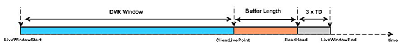

# Een besturingsbalk maken die is verbeterd voor DVR {#construct-a-control-bar-enhanced-for-dvr}

U kunt een besturingsbalk implementeren met DVR-ondersteuning voor VOD en live streaming. DVR-ondersteuning omvat het concept van een doorzoekbaar venster en het live-punt van de client.

* Voor VOD is de lengte van het doorzoekbare venster de duur van het gehele element.
* Voor live streaming wordt de lengte van het DVR-venster (doorzoekbaar) gedefinieerd als het tijdbereik dat begint bij het live afspeelvenster en eindigt bij het live punt van de client.

   De volgende informatie onthouden:

   * Het live punt van de client wordt berekend door de buffered length af te trekken van het live-venstereinde.

      De doelduur is een waarde die groter is dan of gelijk is aan de maximale duur van een fragment in het manifest.
   * De standaardwaarde is 10000 ms.
   * De besturingsbalk voor live afspelen ondersteunt DVR door het blokje eerst op het actieve punt van de client te plaatsen wanneer het afspelen wordt gestart en door een gebied weer te geven dat het gebied aangeeft waar zoeken niet is toegestaan.

<!--<a id="fig_37A39A28BA714BA5A2C461357ED5BD41"></a>-->

{width=&quot;684&quot;}

1. Als u een besturingsbalk wilt implementeren met ondersteuning voor DVR, voert u de stappen in [Een zoekbalk weergeven met de huidige afspeelpositie...](../../../tvsdk-2.7-for-android/content-playback-options/ui-configure/t-psdk-android-2.7-ui-seek-scrub-bar-display.md) met de volgende verschillen:

   * U kunt een controlebar uitvoeren die slechts voor de zoekbare waaier in plaats van voor de playbackwaaier in kaart wordt gebracht.

      Elke gebruikersinteractie voor zoekopdrachten kan in het doorzoekbare bereik als veilig worden beschouwd.
   * U kunt een controlebar uitvoeren die voor de playbackwaaier maar in kaart wordt gebracht die ook de doorzoekbare waaier toont.

      Voor een besturingsbalk:
   1. Voeg een bedekking aan de controlebar toe die de playbackwaaier vertegenwoordigt.
   1. Wanneer de gebruiker begint te zoeken, controleer of de gewenste zoekpositie zich binnen het doorzoekbare bereik bevindt met `MediaPlayer.getSeekableRange`.

      Bijvoorbeeld:

      ```java
      TimeRange seekableRange = _mediaPlayer.getSeekableRange(); 
      if (seekableRange.contains(desiredSeekPosition)) { 
          _mediaPlayer.seek(desiredPosition); 
      }
      ```

      U kunt er ook voor kiezen om met de constante `MediaPlayer.LIVE_POINT` naar het actieve punt van de client te zoeken.

      ```
      mediaPlayer.seek(MediaPlayer.LIVE_POINT);
      ```


